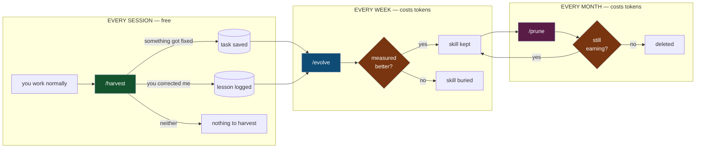
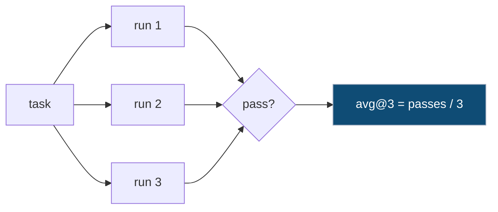
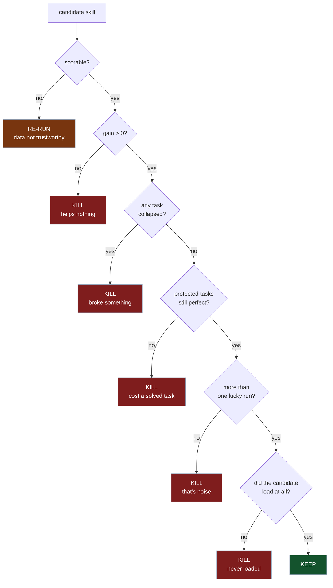
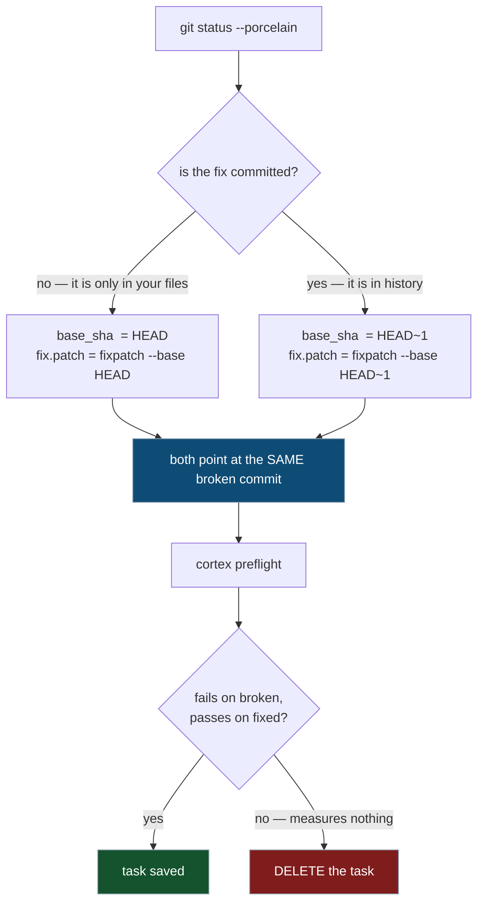
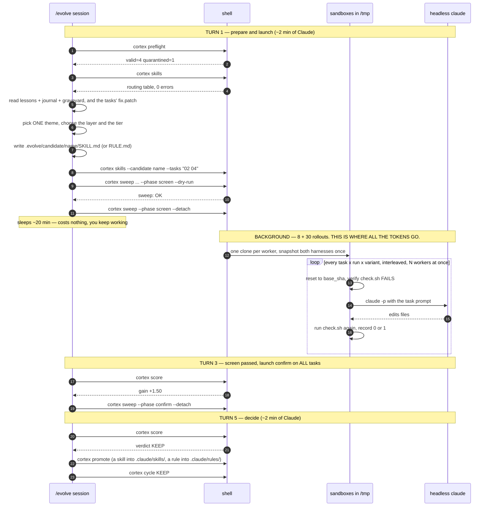
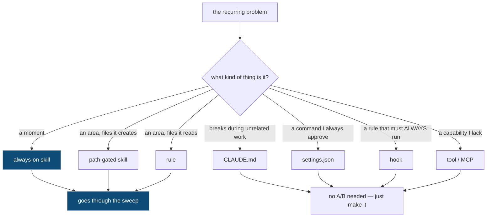
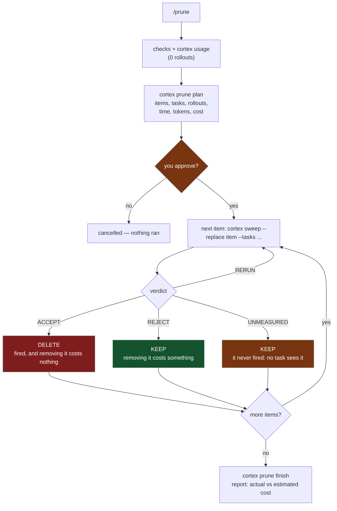
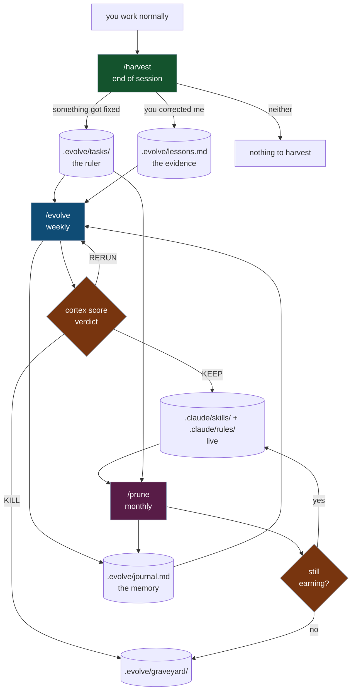
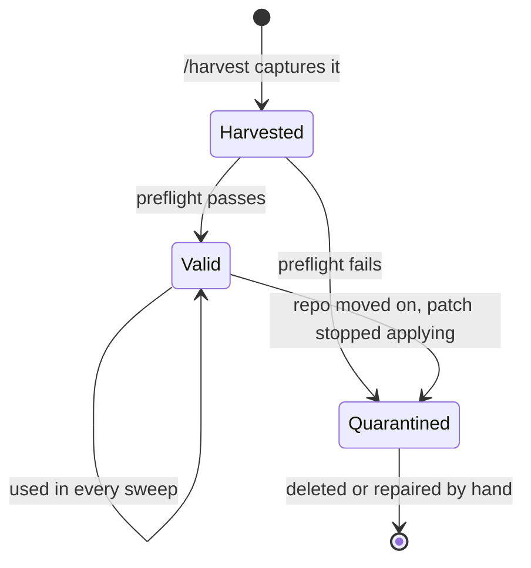
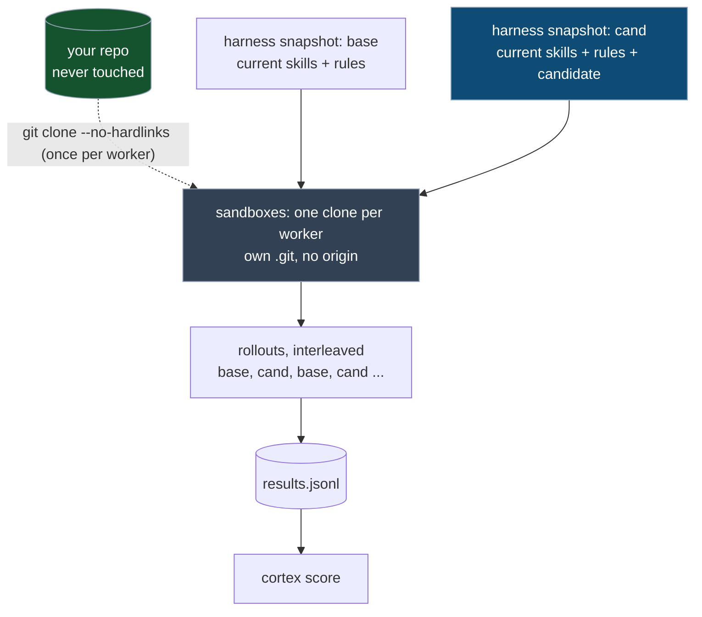

# Cortex

**Evolve your Claude Code skills by measurement instead of by guessing.**

Cortex watches you work, notices what keeps going wrong, proposes one fix,
**measures whether it actually helps**, and keeps it only if it does. It also
deletes skills that stopped earning their place.

It also keeps your context lean: skills and rules that only matter in one part of
the repo load **only when Claude touches that part**, and Cortex measures which
tier each one belongs in.

It is small and practical on purpose: built for what one person can actually run.

---

## Table of contents

**Start here**
- [Glossary — read this first](#glossary--read-this-first)
- [The problem](#the-problem)
- [The idea in one picture](#the-idea-in-one-picture)
- [Install](#install)
- [Getting started](#getting-started)

**How it works**
- [The theory (why this shape)](#the-theory-why-this-shape)
- [How skills load: tiers and routing](#how-skills-load-tiers-and-routing)
- [The three commands](#the-three-commands)
  - [`/harvest` — save what just happened](#harvest--save-what-just-happened)
  - [`/evolve` — propose one skill and measure it](#evolve--propose-one-skill-and-measure-it)
  - [`/prune` — delete what stopped earning its place](#prune--delete-what-stopped-earning-its-place)

**Reference**
- [Reading `cortex score`](#reading-cortex-score)
- [Anatomy of a task](#anatomy-of-a-task)
- [How isolation works](#how-isolation-works)
- [Working with the clone: rules and traps](#working-with-the-clone-rules-and-traps)
- [Configuration reference](#configuration-reference)
- [Every file in this repo](#every-file-in-this-repo)
- [What it costs](#what-it-costs)

**When things go wrong**
- [Troubleshooting](#troubleshooting) — and [docs/TROUBLESHOOTING.md](docs/TROUBLESHOOTING.md) for the full list
- [When to stop](#when-to-stop)

## Glossary — read this first

These words are easy to confuse, and one pair trips up everyone.

| Term | What it is |
|---|---|
| **skill** | a procedure in `.claude/skills/<name>/SKILL.md`. Claude sees only its name and one-line description, and **decides** to open it. **The thing being tested.** |
| **rule** | a few lines of hard "never / always" in `.claude/rules/<name>.md` with `paths:`. Claude Code **injects it automatically** when Claude **reads** a matching file: no choice. Tested the same way as a skill. [Rule or skill?](#rule-or-skill) |
| **tier** | *when* a skill or rule enters context: **always-on** (its description, every turn), **path-gated** (only once a matching file is touched), or a **rule**. See [How skills load](#how-skills-load-tiers-and-routing). |
| **routing** | which items exist and when each one loads. It lives in each file's frontmatter; `cortex skills` validates it and prints it. |
| **task** | a frozen test in `.evolve/tasks/NN/` — a broken commit, a prompt, and a check. **The ruler.** |
| **rollout** | ONE run of `claude -p "<prompt>"` in the sandbox. Starts, works, dies. 38 of these per cycle. |
| **arm** | one side of the comparison. There are exactly two: `base` (your harness as it is now) and `cand` (the same harness with the change under test). |
| **sweep** | the whole batch of rollouts for one candidate. Runs in the background, ~40 min. |
| **cycle** | one complete `/evolve`: propose → sweep → verdict → journal. Weekly. |
| **harness** | everything around the model: skills, rules, `CLAUDE.md`, tools. What Cortex evolves. |
| **sandbox** | the clone of your repo where rollouts happen. Never your working copy. |

### The pair that confuses everyone

| | what it is | when it is created |
|---|---|---|
| **`base`** | one of the two **arms** in a sweep — your current skills and rules | **fresh, every sweep** |
| **`baseline.json`** | a cached **file** of scores from a past cycle | at D4, after a KEEP |

They are unrelated. `base` is measured live, minutes before `cand`, in the same
sweep. `baseline.json` is a week-old cache used only to decide *which tasks are
currently failing* — it never enters the gain calculation.

---

## The problem

You write a skill because Claude did something annoying. You never check whether
the skill helped. Six months later you have forty skills, you don't know which
ones work, and you're afraid to delete any of them.

Meanwhile **every always-on skill's `description` is in the model's context on
every single turn of every session**. Forty unverified skills is not a richer
toolkit. It's a permanent tax plus forty descriptions competing to trigger —
including the ones about a directory you are not even working in.

Cortex fixes all three: nothing gets added without evidence, nothing stays
without evidence, and what only matters in one area is moved into a tier that
loads only there.

---

## The idea in one picture



Three commands. One captures, one adds, one removes.

---

## Install

```bash
cd /path/to/Cortex      # wherever you cloned it
./install.sh
```

This symlinks `cortex` into `~/.local/bin` and checks your environment.

**Requires:** `git`, `jq`, `claude`, `timeout` and `flock` (util-linux/coreutils),
`python3`. For `config.yaml`, PyYAML is used if present and a built-in parser
covers the schema if it is not. Skill and rule frontmatter is always read by
Cortex's own strict parser (`bin/harness.py`), so the checks behave the same
on every machine.

Then, inside any repo you want to improve:

```bash
cd ~/my-project
cortex init
```

which creates:

```
.evolve/              task + lesson store  (commit this; runs/ and candidate/ are gitignored)
  tasks/              your frozen test cases
  lessons.md          one line per correction you made
  journal.md          permanent record of every cycle
  graveyard/          skills and rules that were killed or deleted, each with a BURIED.md saying why
  candidate/          the skill or rule under test right now
  config.yaml         YOU EDIT THIS — every setting, with comments
  config.json         compiled from the YAML; never edit by hand
  state.json          cycle counter for the barren-streak guard, and the model of the last /prune pass
  prune-plan.json     the current /prune plan: items, tasks, estimate, what you approved, what was decided
  runs/               one results file per sweep
.claude/commands/     /harvest  /evolve  /prune
.claude/rules/        path-scoped rules (empty to start)
CLAUDE.md             only if the repo had none anywhere Claude Code looks for one:
                      a minimal root file explaining the tiers. An existing one is never touched.
```

**Upgrading Cortex later** is the same command: re-run `cortex init`. Cortex
records a fingerprint of each command it installs (`.claude/commands/.cortex-installed`),
so it can tell your edits from an older version: an unedited copy is simply
updated, and one you edited is kept as `.claude/commands/<name>.md.bak-<timestamp>`
before the new one is installed. Missing `.gitignore` lines are added too.

---

## Getting started

The fastest path from nothing to a working setup. About ten minutes, and it
spends **no tokens**.

### 1. Install (2 min)

```bash
cd /path/to/Cortex && ./install.sh
cortex doctor          # git, jq, claude, timeout, flock, python3 — and the claude version
```

### 2. Set it up in a real repo (2 min)

```bash
cd ~/my-project
cortex init
```

### 3. Configure the two settings that actually matter (5 min)

Open `.evolve/config.yaml`:

```yaml
baseline:
  model: claude-opus-5        # PIN THIS. Without it you cannot detect a model change.

environment:
  cache_dirs:                 # every build cache YOUR project uses
    - __pycache__             #   JS:   .next, node_modules/.cache
    - .pytest_cache           #   Rust: target      Java: build, .gradle
  sandbox_root: /tmp/cortex-evolve
```

Two traps, both real:

- **If Docker is involved**, check the daemon can read `sandbox_root`. Snap and
  rootless installs have their own `/tmp` and will silently mount an empty
  directory:
  ```bash
  mkdir -p /tmp/t && echo ok > /tmp/t/f
  docker run --rm -v /tmp/t:/m alpine cat /m/f || echo "daemon cannot see /tmp"
  ```
  If that fails, use `sandbox_root: ~/.cortex/sandboxes`.
- **`cache_dirs` decides whether your scores are real.** Leave a build cache out
  and a check can read the *previous* state. Silent, and it poisons everything.

```bash
cortex config          # compile + validate; it will warn about incoherent settings
```

### The commands you now have

| Command | Does |
|---|---|
| `cortex init` | set up `.evolve/` + the three slash commands in a repo |
| `cortex status` | tasks, lessons, skills per tier, always-on context vs budget, DEAD paths, the harness hash, the pinned model, last cycle |
| `cortex preflight [--parallel auto\|N]` | prove every task still discriminates (0 tokens), several tasks at a time; runs even while a sweep does |
| `cortex baseline --model <id>` | freeze current scores as the number to beat |
| `cortex score` | read the last sweep's gain / regression / net |
| `cortex skills` | validate every skill and rule and print the routing table: tier, `paths`, always-on characters, DEAD globs (0 tokens) |
| `cortex promote <name>` | make `.evolve/candidate/<name>` live — a `SKILL.md` into `.claude/skills/`, a `RULE.md` into `.claude/rules/`; refuses to overwrite, and refuses a candidate no confirm has kept (`--force` overrides) |
| `cortex bury <name> --from candidate\|live` | move a skill or rule to the graveyard with a reason; never overwrites an older entry |
| `cortex harness touching <fix.patch>` | which skills and rules cover the files a fix touched |
| `cortex task new --base <sha> [--head <sha>] [--title T]` | the mechanical half of a harvested task: the next `.evolve/tasks/NN/` with `fix.patch` (new files included; with `--head`, only the commits up to it — a late harvest) and `task.yaml`; refuses a base outside `HEAD`'s history |
| `cortex usage [--days N]` | how each skill and rule was used in your real sessions (last `prune.usage_days`) and which tasks can measure it — for choosing what `/prune` tests, **never** for deleting (0 tokens) |
| `cortex prune plan / approve / cancel / next / record / finish / status / estimate` | the `/prune` pass: a plan with rollouts, time, tokens and cost that runs only after you approve it — `/prune` drives it |
| `cortex config [--check]` | recompile `config.yaml` → `config.json`, validating it |
| `cortex phase` | where the `/evolve` cycle stands (A, B, C, D, relaunch, prune), decided from the files |
| `cortex cycle KEEP\|KILL <name>` / `cortex cycle BARREN` | record a cycle, once; exits non-zero on a barren streak |
| `cortex clean [--runs]` | remove sandboxes; `--runs` also deletes past results |
| `cortex doctor` | check `git`, `jq`, `claude`, `timeout`, `flock`, `python3` are present, that `claude` is at least `min_claude_version`, and print what `measurement.parallel` auto resolves to on this machine right now |
| `cortex restore <name>` | legacy: put back a skill parked in `.evolve/ablation/` by an older Cortex (`status` shouts when one is) |

`cortex sweep` exists but `/evolve` and `/prune` drive it — you rarely call it
by hand. `cortex sweep … --dry-run` runs every check that could refuse a sweep
and spends nothing; it also says how many rollouts will run at once.
`--parallel auto|N` overrides `measurement.parallel.rollouts` for one sweep.

### 4. Then: collect for two weeks

Work normally. Run `/harvest` at the end of each session. **Do not run `/evolve`
yet** — it needs at least `min_valid_tasks` (3) to say anything, and more tasks
make a sharper ruler.

When `cortex status` shows 3+ valid tasks and `lessons.md` has a theme repeating
three times, run `/evolve`.

---

## The theory (why this shape)

Every design choice below is forced by a constraint, not chosen for elegance.
This section names the constraint first, then the shape it forces. If you
disagree with a constraint, the corresponding piece of Cortex is the piece you
should change.

This is the short version. [docs/THEORY.md](docs/THEORY.md) has the full
reasoning, each principle tied to the file that implements it, its limits, and
where each idea comes from. Several principles here (a fixed model with an
evolving harness, avg@k, "win something and break nothing", a cheap screen
before a strict confirmation) are adapted from DarwinX (Zhang et al., arXiv
2608.07545). [paper/concept-audit.md](paper/concept-audit.md) compares Cortex
with related work concept by concept.

---

### 1. You cannot move the weights, so move the harness

An agent is **model + harness**. The harness is everything around the model:
prompts, skills, tools, control flow.

You *cannot* retrain Claude. The harness is the only surface available to you,
and with the weights frozen, every improvement you get has to come from the
scaffolding.

It also happens to be the better surface for a different reason. A harness edit
is a **diff a human can read**, sitting next to the evidence that justified it.
A weight update is not. Asking "what changed and why" and getting an answer
without interpretability tooling is a property you get for free here and give up
entirely in weight space.

> **⇒ So Cortex only ever writes text files**: `.claude/skills/*/SKILL.md`,
> `.claude/rules/*.md`, `CLAUDE.md`, `settings.json`, hooks. Every change is a diff, and
> `.evolve/journal.md` records why it was kept.

---

### 2. Fitness must be measured, not judged

Selection is driven purely by measured fitness: no gold solutions, no
hand-picked winners.

This is the constraint that decides whether any of this is real. The moment you
let "this feels better" into the loop, you are back to collecting unverified
skills — only now with extra machinery and more confidence than you have earned.

A verifier is a command that exits `0` or non-zero. A test. A build. A `curl`. A
CTF flag. Not an opinion, not an LLM judge, not your impression of the session.

> **⇒ So a task without `check.sh` is not a task.** `cortex preflight` proves
> each one still *discriminates* — fails on the broken state, passes on the
> fixed state — and quarantines the ones that stopped. A check that passes in
> both states measures nothing, and is worse than having no task, because it
> silently dilutes every score.

---

### 3. The signal is noisy, so one run is worth nothing

Claude is not deterministic. Same task, same prompt, same code:

```
run 1: PASS    run 2: PASS    run 3: FAIL    run 4: PASS    run 5: FAIL
```

The pass-rate swing between identical runs is **often the size of a single
accepted edit**. That is the whole problem in one sentence: the noise is as large as the effect you are trying to detect.

So every measurement is **avg@k**: run it `k` times, take the fraction.



But `avg@k` costs `k` times as much, and most candidates are bad. The
answer is **two speeds — permissive about trying, strict about trusting**:

> **⇒ So Cortex screens at `k=2` on the theme's tasks only** (cheap, kills most
> candidates on ~8 rollouts), **then confirms survivors at `k=3` on everything**.
> Gate 4 refuses to rule on a net of one run, because one run is a coin flip —
> and a KILL that rests only on one task's drop is **re-measured** first
> (`RECHECK`), because one lost run on one task is a coin flip too.

---

### 4. A win must not cost you anything — preserve and extend

The central rule, and the one piece you cannot drop.

> A change is kept only if it **improves something** *and* **breaks nothing**.

Not "improves on average". **Breaks nothing.** The failure mode this exists to
prevent is *cross-task interference*: an edit that fixes one family of tasks and
silently regresses another. Over a mixed task distribution that makes evolution
stagnate — and without measurement you would never see it happening.



Gate 5 is the attribution guard: a candidate that never loaded in any `cand`
rollout cannot have caused a difference, whatever the scores say.

Gate 0 is Cortex's own addition and is **not a KILL**. A truncated sweep, an
API outage, or a task missing from one arm produces numbers that look exactly
like real ones once they are in the journal. Burying a candidate on data that
never measured it is a verdict you did not earn.

> **⇒ So `cortex score` emits `scorable` and `blocked_because`**, tasks scoring
> 1.00 are the protected set (`protected_broken` must be empty), and an
> infrastructure failure is recorded as `valid:0` and excluded rather than
> counted as a capability failure.

---

### 5. The proxy always overfits, so keep the tasks honest

Optimise against a small, fixed set of tasks for long enough and the in-loop
score saturates at **100%** while performance on work the loop never saw stays
where it was. The number being optimised and the number that matters drift apart.

And the sharpest part: **the harness that scores best on your few tasks is
usually not the one that helps most on everything else.** Following the in-loop
score greedily bends the harness around those tasks. (DarwinX reports exactly
this: a training score that reached 100% while held-out tasks stayed near 68%.)

Your 5 tasks will saturate too. Once every task passes, the loop has nothing
left to learn and will start inventing skills that fit those five shapes.

> **⇒ So tasks are cheap and disposable by design.** `/harvest` accumulates them
> from real work at near-zero cost, `cortex preflight` retires the ones that
> stopped discriminating, and the honest move when everything passes is to
> harvest more — not to lower the bar. Aim for many tasks and few skills.

---

### 6. Attribution requires one change at a time

A measurement of the complete system tells you the system helped, not which
part of it did. You can solve that at this scale — but only by being
disciplined about it. Test two skills in one cycle and the
delta is their joint effect, with no way to split it.

There is a second half to this that is easy to miss. Every sweep runs **all your
existing skills and rules plus the candidate** — so what you measure is the candidate's
*marginal* value given everything you already have, never its value in
isolation. A skill that duplicates one you own will correctly show `gain 0`.

> **⇒ So `/evolve` proposes exactly one candidate per cycle**, and answering
> "does skill #7 still earn its slot?" is a *different operation*: remove that
> one skill and re-measure. That is `cortex sweep --replace <skill>`, and it
> is why `/prune` exists as a separate command rather than a step inside
> `/evolve`.

---

### 7. Collect online, evolve offline

Evolve against a refreshed suite of tasks and deploy the selected harness;
do not let a live session modify itself.

Two things make live self-modification unworkable. Fitness needs a verifier and
production tasks rarely arrive with one. And `avg@k` spends `k` rollouts per
candidate per task — affordable as a periodic offline job, never per request.

There is a third reason specific to you: a session that rewrites its own harness
mid-flight is impossible to debug, because the thing you are observing changed
while you were observing it.

> **⇒ So the three commands are strictly separated.** `/harvest` is a sensor: it
> runs at session end, costs nothing, and **never writes a skill**. `/evolve`
> runs weekly, offline, in isolated clones. Rollouts are detached `claude -p`
> subprocesses, and the harness is **snapshotted once** at sweep start so
> editing a skill mid-sweep cannot change the experiment underneath itself.

---

### 8. The context cost is yours alone

It is tempting to treat skills as free and let the harness grow monotonically,
one purely additive edit after another. A benchmark would not mind, because a
benchmark does not read a context window.

**You do.** Every always-on skill's `description` is loaded on every turn of
every session, forever. Fifty of them is not a richer toolkit — it is a
permanent tax plus fifty descriptions competing to trigger. Your real objective is:

```
fitness  =  solve_rate  −  λ · context_cost
```

That single term turns hill-climbing into a *budgeted* search, and it makes
deletion — and **narrowing** (moving an item into a tier that loads only where it
matters) — first-class operators rather than afterthoughts. `cortex skills`
prints `context_cost` directly: the characters always in context, against
`always_on_budget_chars`.

> **⇒ So `/prune` exists as a command of its own, and runs after every model
> upgrade** — because a behaviour the model has internalised leaves the
> corresponding skill as dead weight that still costs you context. Measuring a
> removal never touches your live skills or rules, and an item is deleted only
> when the measurement says removing it costs nothing — never because it has
> not been used lately.

---

### The whole thing, as a mapping

| Constraint | Forces |
|---|---|
| Can't retrain the model | edit only text: skills, rules, `CLAUDE.md`, hooks, settings |
| Fitness must be measured | `check.sh` exits 0/1; `cortex preflight` proves it discriminates |
| Noise ≈ effect size | `avg@k`; screen at `k=2`, confirm at `k=3`; gate 4 rejects one-run wins |
| Wins must cost nothing | `gain > 0` **and** `protected_broken == []` **and** `worst_drop ≤ 0.34` |
| Bad data looks like good data | `scorable` / `blocked_because`; infra failures are `valid:0`, not failures |
| Proxies saturate | tasks are cheap, retired automatically, and meant to keep growing |
| Attribution needs isolation | one candidate per cycle; one removal per sweep, in `/prune`; gate 5 — a candidate that never loaded is never kept |
| Can't evolve live | harvest online, evolve offline in clones, snapshot the harness |
| Context is not free | tiers: path-gated skills and rules cost 0 until needed; `/prune` deletes and narrows, re-measured after every model upgrade |

---

### Sized for one person

| Choice | Why |
|---|---|
| One lineage | A population of alternative harnesses needs far more cycles than one person runs. You'll run ~20. |
| No merging of variants | There is only one lineage, so there is nothing to merge. The cost: work that keeps a population reports that merging specialists can beat each of them (DarwinX). Cortex does not try. |
| 3–10 tasks of your own | You build them by hand, from work you already did. |
| `avg@2` screen → `avg@3` confirm | Cost. |
| `lessons.md` as the teacher | You are the teacher. |
| **Deletion and narrowing are first-class operators** | Context is not free. |

The one capability this design gives up: **two skills that only work
together.** Alone, each shows no gain and gets killed; together they would
unlock a task neither reaches. If you ever suspect that is happening, the manual
workaround is to put both edits in one candidate directory and test them as a
single unit.

---

## How skills load: tiers and routing

Claude Code decides what enters the model's context. Cortex does not add a
loader of its own — it uses the native one, and measures which tier each skill
or rule belongs in. There are four places knowledge can live, from "always
there" to "only when needed":

```
                     ALWAYS IN CONTEXT  (costs tokens on every turn)
 ┌───────────────────────────────────────────────────────────────────────┐
 │ CLAUDE.md (repo root)       the few facts an agent breaks during      │
 │                             UNRELATED work                            │
 │ always-on skills            only the one-line description is listed;  │
 │   .claude/skills/<n>/       the body loads when Claude picks it.      │
 │   (no paths)                For MOMENTS: "before reporting done"      │
 └───────────────────────────────────────────────────────────────────────┘
                     LOADED ONLY WHEN A MATCHING FILE IS TOUCHED  (cost 0 until then)
 ┌───────────────────────────────────────────────────────────────────────┐
 │ path-gated skills           invisible until Claude READS or WRITES a  │
 │   .claude/skills/<n>/       file matching `paths`; then its           │
 │   + paths: ["api/**"]       description appears and Claude can pick it│
 │ rules                       injected automatically, whole, when       │
 │   .claude/rules/<n>.md      Claude READS a matching file (or it is    │
 │   + paths: ["api/**"]       @-mentioned). Never on Write. No choice.  │
 └───────────────────────────────────────────────────────────────────────┘
```

The hierarchy is the directory tree, written as globs: `paths: ["services/api/**"]`
covers a component, `["services/api/migrations/**"]` one corner of it, no
`paths` the whole repo. A rule with `paths` is what used to be a
sub-directory `CLAUDE.md` — but it lives in one folder, is snapshotted by every
sweep, and can be measured and pruned.

### Rule or skill?

| | **Rule** | **Skill** |
|---|---|---|
| File | `.claude/rules/<name>.md` | `.claude/skills/<name>/SKILL.md` |
| What it is | a few lines of hard "never / always" | a procedure: numbered steps, examples, can be long |
| How it gets into Claude | **injected automatically**: Claude has no choice | Claude sees only its **name + one-line description** and **decides** to open it |
| When | when Claude **reads** a file matching its `paths` | *always-on* (no `paths`): its description is there every turn. *Path-gated* (`paths`): appears when Claude **reads or writes** a matching file |
| Cost in context | 0 until a matching file is read | always-on: the description, every turn; path-gated: 0 until triggered |
| Best for | a hard rule for one area, whenever the fix **edits** an existing file there (an Edit always reads it first) | a **moment** ("before reporting done…"), or a **procedure** in an area where the agent only **creates** new files |

In the lab (`lab/`, the end-to-end test of Cortex):

- **Money** → a **rule** on `shop/billing/**`. Claude always *reads* the billing file it
  fixes, so the rule is injected every time, with no reliance on Claude choosing it.
  (This is what `/evolve` chose in round 1.)
- **CHANGELOG** → expected to be an **always-on skill**: it's a *moment* ("before you say
  done"), not a place.
- **New exporters** → expected to be a **path-gated skill**: Claude *creates* a new file in
  `shop/plugins/`, and a rule never triggers on writing a new file.

In one line: a rule can't be skipped, but it only fires for files the agent reads. A skill can carry a whole
procedure and fires on a moment or a new file, but the agent has to choose it. The `notes` of `cortex score`
tell the two failures apart: *no rollout read a matching file* (a rule) versus *visible but never invoked*
(a skill).

### One session, four tiers

The task: *"add a column to the orders table"*.

```
turn 1   in context: CLAUDE.md + the always-on skill descriptions. Nothing else.
turn 2   Claude reads services/api/models/order.py
         -> rule `api` (paths: services/api/**) is injected automatically
turn 3   Claude writes services/api/migrations/0042_add_col.py
         -> skill `api-migrations` (paths: services/api/migrations/**) appears;
            Claude opens it and follows the procedure
turn 4   about to say "done"
         -> always-on `verify-before-done` matches the moment: it runs the test first
```

Everything about `web/` never entered context, because Claude never touched `web/`.

### Which tier — decided from evidence

| The knowledge is… | Tier | Why |
|---|---|---|
| a short hard rule for one area, when the fixes **edit** an existing file there | rule | injected on Read — and an Edit always Reads first — with no choice to skip it |
| a procedure for an area where the fixes only **create** new files | path-gated skill | a Write reveals it; the model must then choose it |
| a moment ("before reporting done", "before committing") tied to no area | always-on skill | it is not tied to a place |
| something an agent breaks while doing something **else** | root `CLAUDE.md` | it must be there before the agent knows it needs it |

**A skill is only *offered*; a rule is *injected*.** The model invokes a skill when
its description names **the task it is doing**, and rarely when it names a **side duty**
of that task. In the lab, with Haiku 4.5: *"When implementing a new exporter plugin…"*
was invoked in 5 of 6 rollouts where it was visible; *"Before finishing changes to
shop/ code, verify CHANGELOG.md was updated"* in 1 of 18; the rule on `shop/billing/**`
loaded in 9 of 9. So a side duty tied to an area (a changelog line, a docs row, a
registry entry, a house helper) belongs in a rule on that area whenever the fixes edit
an existing file there; a skill's description names the task, never the duty.

`/evolve` picks the tier from the files the failing tasks' fixes touched
(`fix.patch`), and derives the globs from them. `/prune` moves always-on skills
into narrower tiers when their use is confined to one area — and both changes go
through the same measured sweep as anything else.

### Behaviour Cortex relies on (verified on Claude Code 2.1.276)

| | |
|---|---|
| a skill with `paths` is absent from the listing until triggered | `system/init` lists only always-on skills |
| it is revealed by **Read or Write** of a matching file | **not** by a Bash `cat` |
| a rule loads on **Read** or an `@file` in the prompt | **not** on Write; it leaves no trace in the output |
| a glob without `/` (`"*.sql"`, `"migrations"`) | matches **at any depth** |
| a glob with a `/` | is anchored at the repository root (`"e6/f6"` does not match `d6/e6/f6/x`) |
| a glob that matches a **directory** | covers every file below it: `"lib/*"` loads for `lib/x/c.py`, a bare `"src"` for `src/sub/a.py` — but `"src/*.py"` does **not** load for `src/sub/b.py` |
| `{a,b}` | brace alternatives are expanded |
| `*` and `**` | match dotfiles and dot-directories |

`min_claude_version` (default `2.1.276`) pins this: `cortex doctor` and every
sweep refuse an older CLI, and a sweep whose rollouts saw two CLI versions is
not scored.

### Keeping the routing true

The routing *is* the frontmatter, so there is no table to regenerate. What can
go wrong is that it stops being **true** — and nothing fails loudly when it does.
`cortex skills` checks it, with zero tokens, and every command runs it:

```
$ cortex skills
routing  always-on 603/3000 chars   (always-on skills + path-less rules + CLAUDE.md)
  TIER         NAME                STATUS    ALWAYS  PATHS / TRIGGER
  always       verify-before-done  ok            53  Use before reporting that a fix or change is complete
  gated        api-migrations      ok             0  services/backend/migrations/**
  rule         api                 DEAD           0  services/api/**
warning: rule api: DEAD glob 'services/api/**' matches no tracked file — repair: 'services/api/**' -> 'services/backend/**' (renamed in 262a64d5ca)
check: 0 error(s), 1 warning(s)
```

| It finds | Why it matters |
|---|---|
| a **DEAD** glob — `paths` that match no file | the item can never load, and nothing fails. After a directory rename, it reads git history and proposes the repaired glob |
| unquoted globs, `": "` in a value | real YAML rejects them, and Claude Code then silently drops the item |
| a description over 1536 characters | Claude Code cuts it there |
| a name that is both a skill and a rule | firing could not be attributed |
| a symlink pointing outside the repository, or dangling | a sweep would copy that file into the sandbox, or fail to copy it |
| a duplicate frontmatter key | strict YAML loaders reject it; which copy wins is undefined |
| a skill named like a command in `.claude/commands/` | the two collide |
| a nested `*/.claude/skills/` | Claude Code loads it, but no sweep snapshots it — use `paths:` instead |
| a same-name item in `~/.claude/` | its firing would be counted as this one's |
| a path cited in a body that no longer exists | drift: the code moved, the text did not |
| always-on characters over `always_on_budget_chars` | the permanent tax is growing |
| **a candidate no task in the sweep can load** (`--candidate … --tasks …`) | every rollout would measure nothing — refused before a token is spent |
| a candidate with `disable-model-invocation: true` | no rollout can ever load it |

Items you wrote by hand **warn** rather than fail — Cortex never refuses to run
because of how a file it did not write is phrased. The exceptions are the three
things that would corrupt any measurement: a name that is both a skill and a
rule, and a symlink that leaves the repository or dangles. The candidate under
test gets the strict rules, every one of them an error.

| Command | Routing work it does |
|---|---|
| `/harvest` | `cortex skills --quiet`, and notes which items cover the files the fix touched (`area:`) |
| `/evolve` | checks at A1; applies printed DEAD-glob repairs; `cortex skills --candidate` before any sweep; `cortex promote` puts a kept skill or rule in its tier |
| `/prune` | checks at Step 1; measures removals **and narrowing**; `cortex bury` removes a skill or a rule |

---

## The three commands

Cortex is three slash commands you run inside Claude Code. They are installed
into `.claude/commands/` by `cortex init`, and each one is a Markdown file of
instructions that Claude follows step by step.

They do completely different jobs and run on completely different schedules:

| Command | When | Costs | What it does |
|---|---|---|---|
| **`/harvest`** | end of every session | **zero rollouts** — one short turn | saves what just happened as a test case |
| **`/evolve`** | weekly | 8–38 rollouts | proposes ONE skill, measures it, keeps or kills it |
| **`/prune`** | monthly, and after every model upgrade | only what **you approve**: a plan with its rollouts, time, tokens and cost — each item measured on the tasks where it loads | deletes skills and rules whose removal measurably costs nothing, and narrows always-on skills into cheaper tiers |

The order matters. `/harvest` builds the ruler. `/evolve` uses the ruler to add
things. `/prune` uses the same ruler to remove things. **Without `/harvest` the
other two have nothing to measure with**, which is why the advice is always to
run only `/harvest` for the first two weeks.

---

# `/harvest` — save what just happened

**File:** `commands/harvest.md` → installed to `.claude/commands/harvest.md`

## What it does, in plain words

You just spent an hour fixing something. The containers are up, the database is
seeded, you know exactly what was broken and what the command was that proved
you fixed it.

`/harvest` freezes that moment into a reusable test.

## Why it runs at session end and not later

Because the expensive part of building a test is **recreating the situation**,
and right now you do not have to — it already exists. Your scrollback has the
failing command. Git has the before and after. The services are running.

Rebuilding all of that from a transcript next week is roughly ten times the
work, and you will not do it. That is the entire reason this command exists at
the end of a session rather than as a separate chore.

## What you type

```
/harvest
```

That is all. It takes about thirty seconds and spends no rollouts.

---

## Step 1 — The filter (and why it is the most important step)

Claude asks itself exactly two questions:

```
A. Did something go from broken to working?
   (a failing test went green, a build started passing, a service came up)

B. Did the user correct Claude? Once is enough.
   ("you forgot the CHANGELOG", "CI still fails because…", "we never do it that way")
```

B used to say "two or more times about the same thing". That hid the signal: a
recurring mistake usually shows up as **one** correction in each of several
sessions, and a session corrected once wrote no lesson, so `/evolve` never saw it
recur. Every correction is now one lesson line.

**If neither is true, it prints `nothing to harvest` and stops.** No files are
written.

This sounds like the least interesting step. It is the most important one.

If `/harvest` captured every session you would have two hundred junk tasks in a
month — tasks that do not actually test anything, that fail for random reasons,
that dilute every score you ever compute. A suite of two hundred bad tasks is
worse than no suite, because it produces numbers, and numbers get believed.

**`nothing to harvest` should be your most common outcome.** That is the command
working correctly, not failing.

---

## Step 2 — Capture the task

Only if something genuinely went broken → working. Claude picks the **single**
clearest one. One task per session, never three.

### 2a. Work out the two states

```bash
git status --porcelain
```

**The question `base_sha` answers is:** *"where do I put the repo before the
agent starts?"*

A task has to be replayable 38 times, and every replay must begin from the
**broken** state — otherwise there is nothing to fix. `base_sha` is a commit id.
That is all it is: a bookmark saying *rewind to here*.

There are two cases, because git history is a line and **the fix is either saved
into it or it is not**.

#### Case 1 — you fixed the file but have not committed

```
history:   9c2bcd8  "add calculator"   <- has the BUG
                ^
              HEAD

your file on disk:  FIXED  (not in git yet)
```

```
HEAD is at: 9c2bcd8  ->  def add(a,b): return a - b   # BUG
your file on disk:       def add(a,b): return a + b   # fixed
```

Git history still holds the bug; your fix exists only as unsaved edits. So:

```
base_sha  = HEAD        (9c2bcd8)
fix.patch = cortex harness fixpatch --base 9c2bcd8    (your unsaved edits)
```

#### Case 2 — you committed the fix

```
history:   9f1c2ff  "fix add()"        <- FIXED
           9c2bcd8  "add calculator"   <- has the BUG
                ^
              HEAD is now on 9f1c2ff
```

```
HEAD    = 9f1c2ff  ->  def add(a,b): return a + b   # fixed
HEAD~1  = 9c2bcd8  ->  def add(a,b): return a - b   # BUG
```

**`HEAD~1` just means "one commit back".** So:

```
base_sha  = HEAD~1                 (9c2bcd8)
fix.patch = cortex harness fixpatch --base 9c2bcd8    (the commit, plus anything unsaved)
```

In practice `/harvest` does not type any of this: once it knows `base_sha`, it runs
`cortex task new --base <base_sha> --title "..."`. That creates the next free
`.evolve/tasks/NN/` and writes both `fix.patch` and `task.yaml` itself.

**Why not `git diff`:** it silently leaves out files the fix *created* (a new
module, a fixture, a golden file) because git does not track them yet. The patch
then no longer fixes anything, and preflight quarantines a perfectly good task.
`cortex harness fixpatch` diffs `base_sha` against the working tree through a
throwaway index, so new files are in, your own staging is untouched, and
`.evolve/`, `.claude/` and the `harness_files` stay out: they are the
experiment, not the fix.

**Claude committed twice?** Agents often commit on their own, and a corrected session
can leave two commits: the first attempt and the fix of it. `base_sha` is then the commit
below **both**, the state the user started from. `HEAD~1` would start every rollout from
the half-finished first attempt:

```
history:   c3  "use the rates helpers"      <- the corrected fix
           c2  "handle fractional rates"    <- the first attempt (wrong)
           c1  "QA: tests for tax rates"    <- base_sha: where the user started
```

**Harvesting late, after other work was committed on top?** Then "every change since
`base_sha`" would sweep that other work into the patch too. Name the session's last
commit as well: `cortex task new --base c1 --head c3` takes exactly the commits
`c1..c3`, and nothing after them.

#### The thing that makes it click

**Both cases land on the same commit — `9c2bcd8`.**

The broken state never moved. What changed is only *how you name it*: before
committing it is `HEAD`, after committing it is `HEAD~1`. That is the entire
difference between the two cases.

#### What `fix.patch` is actually for

Not what most people assume. **It is never given to the agent** — that would be
handing over the answer key. It exists so `preflight` can prove the task is real:

```
rewind to base_sha  ->  run check.sh  ->  must FAIL   "there is work to do"
apply fix.patch     ->  run check.sh  ->  must PASS   "the work is doable"
```

Then it is discarded. It validates the exam; it is not part of the exam.

#### What getting it backwards actually does

Not an error. Something worse — a task that quietly measures nothing:

```
CORRECT   base_sha = the broken commit
   check on broken state: fail   <- there is work to do
   check on fixed  state: pass   <- the task is solvable

BACKWARDS base_sha = the fixed commit
   check on "broken" state: PASS  <- the repo ALREADY WORKS
```

The agent is handed a working repo. It has nothing to do. `check.sh` passes
anyway:

```
base  1.00
cand  1.00
gain  0.00     ... forever, on every sweep, for the life of that task
```

It never crashes. It contributes a zero to every average you ever compute and
dilutes the real tasks around it. **This is why step 2c is non-negotiable** — the
rule *broken must fail, fixed must pass* catches it automatically.



### 2b. Write the task folder

Claude creates the next free number under `.evolve/tasks/`:

```
.evolve/tasks/07/
├── task.yaml         id, title, base_sha, timeout
├── prompt.txt        what you originally asked, VERBATIM
├── fix.patch         the fix, new files included (written by cortex task new)
├── check.sh          the command that proves it works
├── precondition.sh   OPTIONAL — only if services must be running
└── notes.md          one line: what was actually wrong (+ the `area:` line, Step 4)
```

**`prompt.txt` must be your original words.** Not a cleaned-up version, not one
with hints added that you only knew afterwards. The task is to reproduce what
the agent actually faced. If you asked *"why is the broker rejecting this"*, that
is the prompt — not *"fix the T2 ownership check in policy.py line 40"*.

**`check.sh` is the hard part.** Five rules, in order of how badly people get
them wrong:

```bash
# 1. It must exit 0 when solved, non-zero when not. Nothing else matters.
#    No output parsing, no judgement, no "looks right to me".

# 2. It checks EVERYTHING you asked for in the session, corrections included.
#    You said "amounts stay integer cents"? The check fails on a float.
#    You said "add the CHANGELOG entry"? The check fails without one.

# 3. BE SPECIFIC. This is the single most common way to ruin a task:
pytest -q                                   # BAD  — the whole suite
pytest tests/test_broker.py::test_t2 -q     # GOOD — the one test that was red

# 4. Only what exists at base_sha, plus files in the task folder. A test
#    written DURING the session is part of the fix — a rollout agent will not
#    write that same file. Copy it into the task folder and run the copy:
cp "$(dirname "$0")/test_check.py" tests/test_cortex_check.py
python3 -m pytest -q tests/test_cortex_check.py
#    A file that must have changed (changelog, registry, docs):
if git diff --quiet <base_sha> -- CHANGELOG.md; then exit 1; fi

# 5. No hidden dependencies. If it needs a running service, assert that in
#    precondition.sh — never let a dead container look like a failure.
```

Rule 2 is what lets a skill be measured at all. Your correction becomes a
lesson; if the check does not verify it, a rollout that repeats the mistake
still passes, and no skill about that mistake can ever show a gain.

Rule 3 deserves a moment. If `check.sh` runs your whole test suite, it probably
passes **both** before and after the fix (the one broken test is a drop in the
ocean, or the suite is green anyway). The task then always passes, contributes
nothing, and quietly waters down every average. Step 2c catches it.

Rule 4 is the quiet one. A check that runs a test the fix itself added passes
preflight (the patch brings the test along) and then fails in **every** rollout
of both arms, because no agent writes that exact test. Step 2c catches that too.

### 2c. Verify the task actually discriminates — non-negotiable

```bash
cortex preflight
```

This runs `bin/preflight.sh`, which for every task uses a throwaway checkout
(never your working copy) and proves two things:

```
checkout base_sha                    →  run check.sh  →  it MUST FAIL
apply fix.patch                      →  run check.sh  →  it MUST PASS
apply fix.patch WITHOUT test code   →  run check.sh  →  it MUST PASS
                                        (only when the fix edits test code)
```

A task that does not fail before the fix is not measuring anything. A task that
does not pass after the fix is broken in some other way — the patch stopped
applying, a dependency is missing, the path is wrong. A task that passes only
with the fix's own test code grades every rollout on writing that same test
(rule 4). "Test code" is a source file with a test name (`test_*`, `*_test.*`,
`*.test.*`, `*.spec.*`, `*_spec.*`, `conftest.py`, `*Test.java`) or a source file
inside `tests/`, `test/`, `spec/` or `__tests__/`. Test **data** the fix adds — a
golden file, a fixture, a snapshot — stays in: producing it can be the very house
rule the task is about (an exporter needs its golden file). Every state
is checked the way a sweep sees it: without `.evolve/`, with `check.sh` run from a
**copy** of the task folder outside the repository, and the checkout as its working
directory. A check that `cd`s relative to its own location would otherwise land in
your working copy, which already has the fix, and "pass". A quarantined task gets
one line of reason (for a failing fixed state, the check's own last output), so
the author can repair it instead of guessing.

Tasks are checked several at a time (`measurement.parallel.preflight`), each in a
worktree of its own, and printed in task order. A task that fails while others run
beside it is checked again **alone** before any verdict, and each check is also run
**twice at the same moment** to find the ones that cannot share the machine (see
*Tasks that cannot run beside each other*). Every decision is written to
`.evolve/runs/preflight.log` as it is made, and a quarantined task carries its
reason in `_broken/<id>/QUARANTINED.txt` — so a preflight that is interrupted still
tells you what it did. Preflight has a lock of its own,
not the sweeps': `/harvest` can check its new task while `/evolve` measures in the
background. The only thing the two share is the moment a sweep copies the tasks —
it waits while a preflight is moving failing ones into `_broken/`.

```
task    broken-state  fixed-state  verdict
07      fail          pass         ok            ← keep it
08      PASS          pass         QUARANTINE    ← check.sh too broad
09      fail          FAIL         QUARANTINE    ← patch or verifier broken
10      fail          pass         QUARANTINE (the check needs the fix's own test code …)
```

If your new task is quarantined, **delete it and say so** — except for the last
reason, which `/harvest` repairs once: copy the test into the task folder, point
`check.sh` at the copy, move the task back and preflight again. A bad task is
worse than no task, because it silently corrupts everything downstream.

---

## Step 3 — Capture the lesson

Only if you corrected Claude. **One line**, appended to `.evolve/lessons.md`:

```
2026-09-17 | task 07 | said the fix worked without running the test | run the test first
```

The task id (`no task` when none was harvested) is how `/evolve` finds the tasks a
theme came from: those are what it screens a candidate on. Not an essay. Write what Claude **did**, not a general theory of what it should
have done.

> **`/harvest` never writes a skill.** A lesson is *evidence*. A skill is a
> *conclusion*. A skill is only earned once the same lesson has appeared three
> times, and making that judgement is `/evolve`'s job. Jumping straight from one
> annoyance to one skill is exactly how you end up with forty unverified files.

---

## Step 4 — Report

One line, nothing more:

```
harvested task 07 + 1 lesson   area: api-migrations
```
```
nothing to harvest
```

Before reporting it runs two zero-token routing checks: `cortex skills --quiet`
(its `check:` line joins the report when it finds anything), and, for a new
task, `cortex harness touching` on its `fix.patch` — the `area:` line, which it
also appends to the task's `notes.md`. A task that keeps failing inside the area
of a live skill or rule is evidence, for `/evolve`, that the item is not working
there.

## What can go wrong

| Symptom | Cause | Fix |
|---|---|---|
| Your new task is quarantined immediately | `check.sh` too broad, or `base_sha` backwards | fix `check.sh` to the one failing test |
| `nothing to harvest` every time | you are reviewing/planning, not fixing | normal — keep working, harvest when you fix something |
| Task passes on the broken state | `check.sh` runs the whole suite | narrow it to the specific test |

---

# `/evolve` — propose one skill and measure it

**File:** `commands/evolve.md` → installed to `.claude/commands/evolve.md`

## What it does, in plain words

Once a week it looks at what keeps going wrong, writes **one** skill or rule to
fix it, runs your tasks with and without it, and keeps it only if the numbers say
it helped without breaking anything.

The whole thing in one sentence:

> **Make a copy of your repo, put one new note in the skills folder, ask Claude
> to fix the same bug 38 times — 19 with the note and 19 without — count which
> did better, and keep the note if it won.**

Everything below is detail on that sentence. Before the phases, five things that
confuse everyone the first time.

---

### 1. A "rollout" is a separate program, not a conversation

This is the biggest source of confusion. The Claude you are typing to is a
**conversation**: it remembers, it has scrollback, it lasts hours.

A rollout is **a command**:

```bash
claude -p "fix add() in src/calc.py"
```

It starts. It reads that one sentence. It does the job. It prints. **It dies.**
No memory, no history, no idea you exist or that 37 others are running. Exactly
like `python fix.py`.

The sweep is a shell loop that launches them one after another — here the
confirm sweep, 5 tasks × 3 runs × 2 arms = 30 (the screen before it spent 8, so
38 for the cycle):

```bash
for task in 01 02 03 04 05; do
  for run in 1 2 3; do
    for variant in base cand; do

        git checkout -f <broken commit>   # rewind the copy
        install this variant's skills + rules   # with or without the candidate

        claude -p "fix add() in src/calc.py"   # <- NEW PROGRAM. ~2 min. dies.

        ./check.sh                        # did it work? 1 or 0
        echo '{...}' >> results.jsonl     # write down the answer
    done
  done
done
```

Run a stub `claude` through that loop and you can see it plainly — six passes,
six different process ids:

```
I am program PID 3542228 | my job: fix add() in calc.py
I am program PID 3542230 | my job: fix add() in calc.py
I am program PID 3542232 | my job: fix add() in calc.py
I am program PID 3542234 | my job: fix add() in calc.py
I am program PID 3542236 | my job: fix add() in calc.py
I am program PID 3542238 | my job: fix add() in calc.py
```

Six programs. Each started, did one job, died. **Everything they wrote is thrown
away.** All 38 produce between them is 38 bits: worked, or didn't.

And the `/evolve` session you started — the conversation — is **asleep** for all
of it. Two turns of real work from it, forty minutes of disposable programs doing
the actual measuring.

---

### 2. A task is a question you re-ask, not a job that gets finished

A task is not something you complete once. It is a **unit test for skills**.

You do not run `pytest` once and say *"done, never again"*. You run the same
tests on every commit, forever. A Cortex task is exactly that: a fixed ruler you
reuse every time you want to measure something new.

It can be re-asked because **every rollout rewinds the repo**:

```bash
git checkout -f <base_sha>     # the bug is BACK
git clean -qfdx
```

There is never an "already fixed" state to skip.

```
WEEK 1   candidate: verify-before-done
         run tasks 01,02,03,04,05  with and without it   ->  KEEP

WEEK 2   candidate: docker-subset
         run tasks 01,02,03,04,05  with and without it   ->  KILL
         ^^^^^^^^^^^^^^^^^^^^^^^^  the SAME five tasks

WEEK 3   candidate: cypher-scoping
         run tasks 01,02,03,04,05  again                 ->  KEEP
```

**The tasks never change. The candidate changes.** If a task only ran once, you
would have measured your first candidate and then had no ruler left for the
second.

---

### 3. Nobody "chooses" a skill — they are sticky notes on a wall

Claude always sees every **always-on** skill's **title** (its `description`).
It only opens one when the title matches what it is doing *right now*.
(Path-gated skills and rules follow the same idea one level earlier: their
title is not even on the wall until Claude touches a matching file — see
[How skills load](#how-skills-load-tiers-and-routing).)

```
.claude/skills/
  verify-before-done/    "Use before reporting a fix is complete"
  docker-subset/         "Use when starting compose services"
  cypher-scoping/        "Use when writing Neo4j queries"
```

The three titles are always in context. The contents are not.

**The trigger is usually not the prompt.** Walk through one rollout — the job is
`"fix add() in src/calc.py"`:

```
minute 0   reads the prompt
           "use when starting compose services"       -> no match, ignored
           "use when writing Neo4j queries"           -> no match, ignored
           "use before reporting a fix is complete"   -> no match YET

minute 1   edits calc.py

minute 2   about to say "done"
           -> NOW "use before reporting a fix is complete" matches
           -> opens it, runs the test first, finds it still fails, keeps working
```

The skill that decided the outcome had **nothing to do with the prompt**. It
fired two minutes in, because of what Claude was *doing*, not what it was *asked*.

That is why a skill's `description` must name **the moment**, not the topic:

```yaml
description: Testing best practices for this repo     # BAD  - a topic; never matches a moment
description: Use for Python work                      # BAD  - too broad; fires unpredictably
description: Use before reporting a fix is complete   # GOOD - a moment Claude actually reaches
```

And the consequence: **if a candidate's title never matches anything, it never
gets opened, and it is killed** — gate 5 refuses to keep a candidate that never
loaded, even if the scores moved. Correctly — a note nobody ever reads is pure
context tax. `notes` then tells you which half failed: a path-gated skill that
**never became visible** (fix `paths`), one that was **visible but never
invoked** (fix the description), or a rule that **no rollout read a matching
file for** (fix `paths`, or harvest a task in that area).

---

### 4. Both arms load ALL your skills and rules

The two arms are not "empty vs the candidate". They are:

```
base = every skill and rule you currently have
cand = every skill and rule you currently have  +  the one candidate
```

So you measure the candidate's **marginal** value — what it adds on top of what
you already own.

This matters. Suppose you already have `verify-before-done` and the candidate is
`check-before-finish`, a near-duplicate:

```
against an EMPTY base:   0.00 -> 1.00   gain +1.00   KEEP a duplicate (wrong)
against your REAL base:  1.00 -> 1.00   gain  0.00   KILL it (right)
```

And it costs almost nothing: a skill's title is ~100 characters, so twenty
titles is roughly **0.3%** of a rollout's tokens. The expense is the 38 agent
runs, not what is in the folder.

---

### 5. The skill is FROZEN for the whole sweep — a failing rollout changes nothing

The natural assumption is that a failed rollout makes the system tweak the skill
and try again. **It does not.** The skill file is snapshotted once, before any
rollout runs, and all 38 use the identical file:

```bash
snapshot_harness      # ONCE, before the loop
  base = your skills and rules
  cand = your skills and rules + the candidate

# then, every rollout:
install_harness "$v"  # copies FROM the snapshot, never from anywhere live
```

A failing rollout does exactly one thing: writes `"pass": 0` to a file.

**Why not retry until it passes?** Two reasons, and the second is the important one.

**A moving target cannot be measured.** If the skill changed after rollout 5,
then rollouts 1–5 tested one skill and 6–38 tested another. Averaging them gives
a number that describes neither. (This was a real bug once: the harness used to
be re-read live on every rollout, so editing a skill mid-sweep silently changed
the experiment underneath itself.)

**"Tweak until green" manufactures a fake result.** Iterating against 5 fixed
tasks converges on a skill that *memorises those 5 tasks*, not one that is
actually useful. The in-loop score saturates at **100%** while nothing outside
those 5 tasks gets better, and the skill that fits those tasks best is **not**
the one that helps most elsewhere.

The gate is a pass/fail exam, not a negotiation. Retaking it with a modified
answer until you score well is not measurement.

#### So how does a skill ever improve?

**Across cycles, never within a sweep.**

```
WEEK 1   candidate: verify-before-done v1
         gain 0.00  ->  KILL  ->  .evolve/graveyard/verify-before-done/
         journal:  "gate1 gain is 0 — helps nothing"

WEEK 2   /evolve A3 reads the graveyard FIRST
         sees v1 was tried, and why it failed
         ->  proposes a different approach, or a different theme entirely
```

That is why A3 reads `.evolve/graveyard/` and `.evolve/journal.md` before
anything else. Each `/evolve` is a fresh session with no memory of last week —
those two files are the only thing carrying a failure forward.

#### What to do with a failed candidate

`gates_failed` tells you which wall it hit:

| Failure | Likely cause | Next cycle |
|---|---|---|
| `gate1 gain is 0` | duplicates a skill you already have, or does not help the failing tasks | accept it is already covered, or a different approach |
| `gate5 … never loaded` | it never fired — `notes` says whether it was never visible (fix `paths`) or visible but never invoked (fix the **description**) | rewrite the trigger, not the procedure |
| `gate3 broke the protected set` | conflicts with an existing skill | narrow its trigger, or drop it |
| `gate4 net is 0.33 runs` | real but indistinguishable from noise | raise `k.confirm` if you believe it is genuine |
| `verdict RERUN` | never fairly measured | **not a failure** — fix the cause and sweep again |

That last row matters: a `RERUN` does **not** go to the graveyard. Burying a
candidate that was never measured would be a verdict you did not earn.

#### The honest limitation

There is no automated "try v2, v3, v4". A human, or next week's `/evolve` reading
the journal, decides whether a different phrasing is worth another 38 rollouts.

That is deliberate restraint, not a missing feature. An automatic retry loop is
the shortest path to a skills folder that aces your five tasks and helps with
nothing else.

---

## Why it takes several turns

A sweep is 8–38 separate headless Claude runs, each taking minutes. That is
forty minutes to an hour of wall clock, and it must not block your session.

**Those 38 runs are the entire cost of a cycle.** Each one is a full agent
session — reading files, editing, running tests — at roughly 150k tokens. The
`/evolve` conversation that starts and finishes them is ~15k tokens across all
its turns, under 1% of the total. When the diagram says the session is asleep, it
means *the supervising conversation* is free, not that the work is.

So `/evolve` launches the work **in the background** and goes to sleep, waking up
to check on it. You will see it across **4 to 5 turns**. You can carry on working
the whole time — the rollouts happen in isolated clones under `/tmp`.

## What you type

```
/evolve
```



---

## Step 0 — Where am I?

Because the command spans turns, the first thing it does is ask Cortex which phase
it is in. Cortex decides from the files, not the model:

```bash
cortex phase
```

```
no candidate                                     → phase A        fresh cycle
candidate, never swept                           → phase B        launch the screen
candidate's sweep running                        → phase C        poll
candidate's sweep ended                          → phase D        decide (screen → D2, confirm → D3)
candidate's sweep unfinished, nothing running    → phase relaunch the sweep died: run it again
a /prune sweep or replacement owns the lab       → phase prune    stop, try later
```

Why a command and not a table the model reads: the newest results file is not
always this cycle's. In the lab's second round, the candidate folder was empty,
which means a fresh cycle. But the newest file was the previous cycle's finished,
already-promoted confirm. The model read it as its own, replayed that cycle's
ending, and recorded the same KEEP twice. `cortex phase` looks only at sweeps of the
current candidate, and `cortex cycle KEEP <name>` refuses to record one cycle twice.

---

## PHASE A — prepare (turn 1)

### A1. Preflight — are the tasks still good?

```bash
cortex preflight            # runs bin/preflight.sh — 10 seconds, zero tokens
```

**Tasks rot.** Your repo moves on, patches stop applying, a check that used to
be red goes green for an unrelated reason. Evolving against a rotten task means
optimising noise, and nothing would tell you.

```
valid=4 quarantined=1 skipped=0
```

Three ways this stops the cycle right here, for free:

- **exit 2** — fewer valid tasks than `min_valid_tasks`. *"Only 2 valid tasks —
  run /harvest more before evolving."*
- **exit 3** — a `precondition.sh` says the environment is not ready. Nothing is
  quarantined; start your stack and try again.
- mass quarantine — almost always your environment, not your tasks.

Then `cortex skills`, zero tokens. An `error:` (a name that is both a skill and a
rule, a symlink that leaves the repo or dangles) stops the cycle. A **DEAD** glob with a printed
`repair:` is applied on the spot and journaled as `kind: path-repair` — a dead
item never loads, so there is nothing to measure.

### A2. Is the baseline still valid?

The baseline is the score to beat, cached in `.evolve/baseline.json`. It is
reused **only if all of these hold**:

```
same model as today
newer than baseline_max_age_days (default 30)
hash_v is 2, and skills_hash equals the `harness` line of `cortex status`
  (skills + rules + harness_files, paths included — moving a skill into a
   rule, or editing CLAUDE.md, is a different harness)
```

Otherwise it is re-measured. The model check matters more than it looks: a
baseline measured on an older model silently flatters every skill you own,
because it was measured against a weaker starting point than you actually have.

No valid baseline — the very first cycle, or a stale one — blocks nothing. The
screen's `base` arm measures its tasks under the current harness anyway, and the
confirm re-measures every task. `baseline.json` carries `failing`: the tasks the
live harness does not solve every time (`live` has the per-task rates).

```
task 01:  1.00     ← protected (perfect, must not drop)
task 02:  0.33     ← weak
task 04:  0.00     ← failing
task 05:  1.00     ← protected
          ────
  suite = 2.33 of 4.00
```

### A3. Find the ONE recurring theme

Claude reads four sources, in this order:

```bash
tail -40 .evolve/lessons.md      # your corrections
ls .evolve/graveyard/            # ideas already tried and KILLED — do not repeat
tail -60 .evolve/journal.md      # what past cycles concluded
```

plus the failing tasks from A2, and the last `lookback_days` of this project's
transcripts under `transcripts_dir`.

The graveyard matters more than it looks. Each `/evolve` runs in a **fresh
session with no memory of last week**. Without reading what was already tried and
killed, it would repropose the same dead idea every Tuesday and pay for it again.

Then it looks for **one** thing that recurs:

```
2026-09-02 | task 02 | claimed the fix worked without running the test | run it first
2026-09-05 | no task | said "should be fine" about the broker         | prove it
2026-09-11 | task 04 | reported done, unit tests were red             | check -m unit
```

Three entries, one theme: **declares success without verifying.** Its tasks —
02 and 04, from the lesson lines — are what the screen will run.

**The bar:** `min_theme_occurrences` (default 3) or more in lessons, **or** it
explains 2+ currently-failing tasks. Below that, Claude runs
`cortex cycle BARREN`, writes `nothing to learn` in the journal, and **stops**.

> This should happen often. A week where nothing recurred three times is a week
> with nothing to learn, and the correct response is to spend nothing.

### A4. Choose the layer — and say it out loud

**Not every problem is a skill.** This is the step people skip, and skipping it
is how a skills folder fills with things that should have been one line in
`CLAUDE.md`:

| The problem is... | It belongs in | Goes through a sweep? |
|---|---|---|
| a *moment* in the work ("before reporting done") | **always-on skill** — `SKILL.md`, no `paths` | **yes** |
| a procedure for one area, incl. files the agent creates | **path-gated skill** — `SKILL.md` + `paths:` | **yes** |
| a short hard rule about existing files in one area | **rule** — `RULE.md` + `paths:` | **yes** |
| a fact an agent breaks during *unrelated* work | **CLAUDE.md** | no |
| a command I always approve | **settings.json** permission | no |
| a rule that must ALWAYS run, no judgement | **hook** | no |
| a capability I lack entirely | **tool / MCP server** | no |



Claude must state its reasoning: *"Skill. A hook would be stronger — it cannot be
ignored — but a hook cannot decide which test to run for a given task."*

Only skills and rules get A/B tested; a hook is deterministic, so there is
nothing to compare. **A cycle can finish without producing a skill at all**, and
that is a correct outcome.

The area comes from evidence, not taste: the files the failing tasks' fixes
touched (`--- a/` / `+++ b/` in `fix.patch`). Clustered in one directory → a
path-gated skill or a rule, with the narrowest glob that covers them. Spread
everywhere → a moment.

### A5. Write the candidate

```
.evolve/candidate/verify-before-done/SKILL.md
```

```markdown
---
name: verify-before-done
description: Use before reporting that a fix or change is complete
---

1. Run the specific check that was failing. Paste the output.
2. Run `pytest -m unit -q`. Confirm still green.
3. If either fails, keep working. Do not report success.
```

A rule candidate is a single file, `.evolve/candidate/<name>/RULE.md`:

```markdown
---
paths:
  - "services/api/**"
---

# api
- NEVER run `manage.py migrate` without `--database=tenant`: it records the
  migration as applied and creates nothing.
```

Before any sweep, `cortex skills --candidate <name> --tasks "<ids>"` checks it
for free — including **reachability**: if no task in the sweep reads (rule) or
reads-or-writes (skill) a file matching its `paths`, it could never load, and the
check refuses rather than spend rollouts measuring nothing.

Four rules:

- **Written to `.evolve/candidate/`, not `.claude/`.** It is not live and
  must not affect the session testing it. Claude is the experimenter here, not
  the subject.
- **Additive only.** Never edit an existing skill or rule in the same cycle as
  adding one — if both changed, the delta is their joint effect with no way to
  split it. Changing a live item's tier or `paths` is a `/prune` operation, and
  the name must be new: lowercase letters, digits and `-`.
- **The trigger matters more than the body** — the `description` for a skill,
  the `paths` for a gated skill or a rule. It decides whether the item ever
  loads. A perfect skill that never triggers is *worse* than no skill: you pay
  the context cost and get nothing back.
- **The writing contract.** A skill or rule constrains an agent about to act; it
  is not documentation. Prohibitions first. Every rule checkable from a diff and
  anchored to a real path. No framework defaults, no rationale essays, no
  in-flight process, nothing copied from elsewhere — point at it. Under ~200 lines.

---

## PHASE B — launch the screen (still turn 1)

```bash
cortex sweep --candidate verify-before-done --tasks "02 04" --phase screen --k 2 --dry-run
cortex sweep --candidate verify-before-done --tasks "02 04" --phase screen --k 2 --detach
```

`--detach` repeats every check, then starts the sweep in a process session of its
own and returns at once: the sweep outlives the Claude session, the chat or the
terminal that started it. (A plain `nohup … &` from inside an agent's shell dies
when that session ends.) Progress goes to `.evolve/runs/sweep.log`.

The dry run comes first, in the foreground. It runs every check that could
refuse the sweep — names, CLI version, reachability, budget, the lock — and
spends nothing. `sweep: REFUSED: …` stops the cycle there; Claude does not
launch, and does not poll, because `cortex score` would read the *previous*
sweep's results as if they were this one's.

**Only the theme's tasks, at `k=2`** — the ids on its lesson lines, minus any the
baseline shows already solved every time. `2 tasks × 2 runs × 2 variants = 8 rollouts`.

The logic: if the skill does not help the things that are already broken, nothing
else matters. You find that out for 8 rollouts instead of 38. **Most candidates
die here**, and that is most of your budget saved.

Then Claude reports and sleeps:

```
theme:     declares success without verifying (3 lessons, 2 failing tasks)
layer:     always-on skill — a moment, not a place; a hook cannot choose which test to run
candidate: verify-before-done  paths: none
screening: 8 rollouts on tasks 02, 04 — in background
back in ~20 min
```

### What the background sweep is actually doing

`bin/sweep.sh`, with no agent supervising:

```
1. clone your repo once PER WORKER (own .git, origin removed — a rollout cannot
   reach you); measurement.parallel.rollouts workers, `auto` sized from the RAM free
2. snapshot the harness ONCE, one per arm — skills AND rules:
     base = your current skills and rules
     cand = your current skills and rules + the candidate
3. for each task, run, variant — INTERLEAVED base/cand, each job taken by the
   next free worker in that order:
     a. checkout base_sha, git clean
     b. purge cache_dirs          ← stale caches silently corrupt scores
     c. install that variant's snapshot harness (replacing any skills, rules
        or harness_files committed at base_sha — the arms run what is live NOW)
     d. run precondition.sh       ← is the environment up? else INVALID
     e. run check.sh — it MUST FAIL  ← proves the reset actually worked
     f. claude -p "<prompt.txt>" --model <pinned>
     g. run check.sh again → pass 0 or 1
     h. record what loaded: skills invoked, skills that became visible, and
        rules whose paths matched a file the agent Read — null if the output
        could not be read (unknown, never "did not fire") — and what the
        rollout cost: its tokens and dollars (Claude Code's own report) and
        its wall-clock time
     i. append one JSON line to .evolve/runs/<timestamp>-<phase>.jsonl
```

Two of those steps are load-bearing and non-obvious:

- **(e)** If the reset silently failed, the previous rollout's fix is still in
  the tree, the check passes, and you record a free PASS that never happened.
  Requiring it to fail first makes that impossible.
- **Interleaved** means `base 02 r1 → cand 02 r1 → base 02 r2 → …`. If the API
  degrades at 09:30, it hits both arms equally instead of landing entirely on
  whichever ran second.

---

## PHASE C — poll (turns 2 and 4)

```bash
cortex score | jq -c '{finished,truncated,scorable,rollouts,invalid}'
```

- still running → report `14/24 rollouts done`, sleep again. One line, quiet.
- `truncated:true` → hit `max_runs_per_cycle`. **Do not score it.**
- `finished:true` → Phase D.

---

## PHASE D — decide (turns 3 and 5)

### D1. Read `scorable` FIRST

```json
{"scorable": true, "blocked_because": [],
 "invalid": 0, "invalid_rate": 0.0, "unmeasured": [],
 "model": "claude-opus-5",
 "per_task": [
   {"task":"01","base":1.00,"cand":1.00,"delta":0.00},
   {"task":"02","base":0.33,"cand":1.00,"delta":0.67},
   {"task":"04","base":0.00,"cand":0.67,"delta":0.67},
   {"task":"05","base":1.00,"cand":1.00,"delta":0.00}],
 "gain":1.34, "regression":0, "net_runs":4.02,
 "worst_drop":0, "protected_broken":[],
 "verdict":"KEEP"}
```

**`scorable: false` stops everything.** It means the data cannot support a
decision: the sweep was truncated, too many rollouts were invalid, a task was
not measured under both variants, what a rollout loaded could not be read
(**firing unknown**), or the CLI changed mid-sweep. `blocked_because` names which.

**Invalid is not the same as failed.** A rollout is *invalid* when the agent
process died for reasons that are not about capability — auth expiry, rate limit,
a 5xx, a hung verifier, a dead container. Those are excluded from the scores,
because counting them would make an API outage look like a regression.

### D2. The screen decision

`cortex score` decides this too. For a screen its verdict is `CONFIRM`, `KILL` or
`RERUN`, **never `KEEP`**:

```
KILL     gain <= 0                    →  cortex bury <name> --from candidate.
KILL     gain >  0, never loaded      →  gate 5: the gain was not its doing, and a
                                         confirm could only KILL it.
CONFIRM  gain >  0, candidate loaded  →  it helps something. Now find out what it COSTS.
```

A screen cannot keep anything, and `cortex promote` enforces it: it refuses a
candidate unless a **confirm** (or its recheck) said KEEP, or a `/prune` swap said
ACCEPT. The lab's first run showed why. A model reading the screen's numbers by
hand promoted straight from it.

Gain was `+1.50`, so the **confirm** sweep launches over **all** tasks at full
`k`: `4 tasks × 3 runs × 2 variants = 24 rollouts`. Then sleep again.

Why two phases: the screen only proves the skill *helps*. It cannot detect
whether the skill *broke* something, because it only ran the tasks that were
already broken. Detecting regression requires running the tasks that already
worked — and that is the expensive half, so only survivors pay for it.

### D3. Read the verdict

**The gates are applied by `bin/score.sh`, not by Claude.** A threshold a model
applies by hand gets rounded or forgotten; one the scorer applies cannot be.

```bash
cortex score | jq -c '{verdict, verdict_because, gates_failed}'
```

```
0. scorable                            ✓   is this data trustworthy at all?
1. gain > 0                     1.34   ✓   did it win anything?
2. worst_drop <= 0.34           0.00   ✓   did any single task collapse?
3. protected_broken == []       []     ✓   tasks 01 and 05 held at 3/3
4. net * k >= 2                 4.00   ✓   more than one lucky run?
5. candidate_fired_runs > 0     6      ✓   did the candidate load at all?
                                          → KEEP
```

- **Gate 3 is the preserve-and-extend contract.** Tasks currently at 1.00 are the
  protected set, and nothing may cost you those — zero tolerance, unlike gate 2.
- **Gate 4 is the noise guard.** A net of one passing run across the whole suite
  is a coin flip, not a result.
- **Gates 1–4 read only exposed tasks.** A task where the candidate never entered
  the agent's context (never visible in any `cand` rollout — a gated skill or a
  rule whose files the agent never touched there) ran the *same* harness in
  both arms, so its difference is noise by construction. It is listed in
  `unexposed` and left out. An always-on skill is exposed everywhere.
- **`RECHECK` is not `KILL` either.** When the *only* failed gates are per-task
  regressions (gate 2 or 3), `score.sh` asks for those tasks to be re-measured:
  at k=3 one unlucky run on a task that went 3/3 in base looks exactly like a
  broken task, and over fifteen tasks that happens to good candidates by chance
  alone. `/evolve` runs `cortex sweep --candidate <n> --tasks "<recheck_tasks>"
  --phase recheck`; `cortex score` pairs that file with its confirm, and the
  regression must fail the **same gate again** on the fresh runs to KILL.
  Otherwise the candidate is KEPT.
- **`RERUN` is not `KILL`.** The candidate was never fairly measured, so burying
  it in the graveyard would be a verdict you did not earn.
- **Gate 5 is the attribution guard.** A candidate that never loaded in any
  `cand` rollout cannot have caused a difference, whatever the scores say.
- **Read `notes` too.** `the candidate never fired in any rollout` means the
  procedure was never tested at all, and the rest of the note says why: *never
  became visible* (a gated skill whose `paths` never matched — fix the paths),
  *visible but never invoked* (fix the description), or *no rollout read a
  matching file* (a rule — fix the paths, or harvest a task in that area).

### D4. Execute

```bash
# KEEP
cortex promote verify-before-done        # refuses to overwrite a live skill or rule
cortex skills                            # the routing table, with the new item in it
cortex baseline --model <your model id>  # the new score to beat
cortex clean                             # sandboxes only; evidence kept

# KILL
cortex bury verify-before-done --from candidate --why "gate1 gain is 0"
```

The graveyard is kept so that A3 next month does not repropose a dead idea.
`cortex bury` never overwrites: a second idea with the same name gets its own
dated entry, with the reason in its `BURIED.md`. (A plain `mv` onto an existing
folder would silently nest the new one inside the old.)

### D5. Record the cycle, then journal

```bash
cortex cycle KEEP verify-before-done     # or KILL <name>, or BARREN
```
```
cycle recorded: KEEP (barren streak 0/2)
```

This maintains the barren counter in `.evolve/state.json` and **exits non-zero**
once `stop_after_barren_cycles` is hit, which stops a loop that has quietly
stopped finding anything and is spending money every week regardless.

Then the journal entry — **every cycle, kept or killed**:

```markdown
## 2026-09-17  verify-before-done
kind:       skill                (gated-skill or rule, with its paths)
paths:      none
theme:      declared success without verifying (3 lessons, 2 failing tasks)
layer:      skill  (hook rejected: cannot choose which test)
screen:     gain +1.50 on tasks 02, 04
confirm:    gain +1.34 | regression 0.00 | worst_drop 0.00 | net_runs 4.02
protected:  tasks 01, 05 held at 3/3
DECISION:   KEEP
suite:      2.33 -> 3.67
```

Recording the **kills** is the unusual part and the valuable one. Six months on,
*"tried parallel tool calls, it broke task 01 completely"* is the entry that
stops you re-litigating an idea you already paid to test.

### D6. Report

```
KEEP verify-before-done
suite 2.33 -> 3.67   tasks 01 and 05 held at 3/3, nothing regressed
next cycle in 7 days
```

## The ways a cycle ends early

| Where | Why | Cost |
|---|---|---|
| A1 | fewer valid tasks than `min_valid_tasks` | **0 rollouts** |
| A1 | `cortex skills` reported an error (skill/rule name clash, bad symlink) | **0 rollouts** |
| A3 | no theme reached `min_theme_occurrences` | **0 rollouts** |
| B1 | the dry run said `sweep: REFUSED:` (e.g. the candidate could never load) | **0 rollouts** |
| D2 | screen showed `gain <= 0`, or the candidate never loaded (gate 5) | 8 rollouts |
| D5 | `cortex cycle` hit the barren limit | full cycle, then stop |

---

# `/prune` — delete what stopped earning its place

**File:** `commands/prune.md` → installed to `.claude/commands/prune.md`

## Why this command exists at all

Every always-on skill's `description` sits in the model's context on **every
turn of every session, forever**. Forty of them is not a richer toolkit — it is a
permanent tax, plus forty descriptions competing to trigger and confusing each
other. Path-gated skills and rules cost nothing until needed, so `/prune` does
two things: **deletes** what stopped earning its place, and **narrows** what only
matters in one area into a tier that loads only there.

A harness that only ever grows costs a benchmark nothing, because a benchmark
does not read a context window. **You do.**
This is the half of the problem that is yours alone.

## The two rules

**A skill or rule is deleted only when a measurement shows that removing it
costs nothing.** Not because it has not been used lately. Not on a hunch. And
not when the task suite cannot see what it does. There is deliberately no
"unused for N days" deletion: a skill for a situation that comes up twice a year
is not dead weight in the months between.

**You decide what gets spent.** A pass is a *plan* — which items, on which tasks,
how many rollouts, how long, how many tokens, what cost — and **nothing runs
until you approve it**. `cortex prune next` refuses to hand out a sweep before
that, so the rule is enforced in code, not only in the prompt.

## When to run it

- monthly, and
- **always after a model upgrade** — a new model may already do what an old skill
  teaches, leaving it as dead weight that still costs you context

## What you see in the terminal

```
> /prune

● cortex preflight          → valid=5
● cortex status             → model claude-opus-6 (same as mine)
● cortex skills             → 7 items, 0 errors
● cortex usage              → how each item was used in your last 30 days
● cortex prune plan --items "check-before-finish migrations-guide"

prune plan  routine — at most 3 items
  #  ITEM                 TIER        STATE     ROLLOUTS  TASKS
  1  check-before-finish  always      pending         12  02 04
                          ↳ overlaps verify-before-done
  2  migrations-guide     always      pending          6  03
                          ↳ biggest always-on description (310 chars)

  will test 2 item(s) · 18 rollouts · ~12 min (3 at a time) · ~2.7M tokens · ~$4.50
  estimate basis: measured: 38 past rollouts of this repo (avg 117 s, 150k tokens, $0.25)

  status: PROPOSED — nothing runs until you approve.

  Approve this prune pass? It will run 18 rollouts (~35 min, ~2.7M tokens, ~$4.50).
  Reply "yes" to start, or name items to drop.
```

The turn ends there. You answer:

- **yes** → it approves the plan and starts the first sweep in the background;
- **"drop migrations-guide"** → it re-plans without it and asks again;
- **no** → the plan is cancelled; nothing ran.

After a **yes**, it measures the items **one at a time** — one background sweep
each, its rollouts running several at once (`measurement.parallel`) — deciding each
before starting the next. Every `/prune`
after that (or its own wake-up, under `/loop /prune`) picks up where it is. You
are asked **once per pass**, not once per item.



## How many items a pass tests

| Situation | Items in the plan |
|---|---|
| **routine** | Claude chooses — **at most `prune.max_items`** (default 3), fewer if fewer are in doubt, **none** if nothing is |
| **after a model change** | **every** skill and rule, no maximum, biggest always-on context first — so if you stop early, the tests that could save the most already ran |

A model change is detected in code: the pinned `baseline.model` differs from the
model the last completed pass ran on (before any pass, from the one the baseline
was measured on). With no pinned model a change cannot be detected, and every
pass is routine — pin it.

## How Claude chooses what to test (routine passes)

It is Claude's judgement, applied to evidence the tools print:

- `cortex skills` — each item's tier, and how many characters it keeps in
  context on **every** turn (the `ALWAYS` column);
- `cortex usage` — how each item was used in **your real sessions** over the
  last `prune.usage_days`, and which tasks can measure it;
- `.evolve/journal.md` — how narrowly each item won its place.

The criteria, from `commands/prune.md` Step 2: items that **overlap** another;
items teaching something the model now does unprompted; items that **won by the
smallest margin**; the **largest always-on descriptions**. And never one that no
task can measure — that could only come out UNMEASURED.

### `cortex usage` — evidence for choosing, never for deleting

```
$ cortex usage
usage  last 30 days · 41 session(s) of this repo  (advisory: chooses what /prune tests — never a reason to delete)
  TIER         NAME                 SESS USES  LAST USE    TOP FOLDER             TASKS THAT CAN MEASURE IT
  always       verify-before-done     38   52  2026-09-18  src/ (41%)             loaded in 01 02 04 05
  always       migrations-guide        6    9  2026-09-12  db/migrations/ (100%)  loaded in 03
                                     ↳ narrowing candidate: 100% of its use is in db/migrations/
  always       old-docker-helper       0    0  -           -                      none
                                     ↳ no use, no task: a removal can only come out UNMEASURED
  rule         billing-rule            4    7  2026-09-16  billing/ (100%)        none
                                     ↳ used, but no task can load it: the suite is blind here — harvest a task
```

It reads this repo's Claude Code session transcripts (in `transcripts_dir`; the
sandbox rollouts live in a different folder, so they never count): **skills**
count their Skill tool calls; **rules** count Reads (or `@`-mentions) of files
matching their `paths` — a rule leaves no trace of its own. It adds where each
item's use concentrates, and — from past sweeps and the tasks' files — which
tasks can load it.

What each hint is for:

| Hint | Use it to |
|---|---|
| `used, but no task can load it` | **not** test it — and harvest a task in that area: the suite is blind there |
| `no use, no task` | not test it: the verdict could only be UNMEASURED, and it stays |
| `narrowing candidate: N% … in <folder>` | propose the Step 5 narrowing: the same skill, gated to that folder |

## What a pass costs

Each item is measured **only on the tasks where it can load**, not on the
whole suite:

| Item | Tasks used |
|---|---|
| path-gated skill or rule | the tasks whose files match its `paths` |
| always-on skill | the tasks where it loaded in past sweeps (no history yet: every task) |
| path-less rule | every task (it is loaded everywhere) |

Where an item does not load, removing it cannot change the result — exactly so
for gated skills and rules; for an always-on skill its description is still
listed elsewhere, a small effect the targeting accepts. So an item costs
`its tasks × k.confirm × 2` rollouts: tens, not the whole suite. The plan skips
items that could only come out UNMEASURED, and flags any over
`max_runs_per_cycle` as blocked (the sweep would refuse them).

The estimate is **measured, not guessed**: every rollout records its real
tokens, cost and wall-clock time from Claude Code's own report, and the plan
averages this repo's history. Before any sweep has run it says it is using
defaults (120 s, 150k tokens per rollout). After the pass, the report compares
what it actually cost (`tokens_total`, `cost_usd_total` of each sweep) with the
estimate.

## Step by step

1. **Where am I?** `cortex prune status` and `cortex prune next --json` — a plan
   waiting for approval, a sweep running, a sweep to decide, or a fresh pass.
2. **Checks** (0 rollouts): `cortex preflight`; the pinned model must be the one
   in use (otherwise it stops and asks you to update `baseline.model`);
   `cortex skills` (errors stop it; a DEAD glob is repaired from the printed
   suggestion and journaled — never buried as "unused"); `cortex usage`.
3. **Plan, show, stop**: `cortex prune plan` — every item after a model change,
   otherwise at most `prune.max_items` chosen by Claude. The plan is printed
   with its estimate, and the turn ends until you answer.
4. **Measure** each approved item: `cortex prune next` prints its targeted
   command; dry-run, then launch in the background.
5. **Decide** from `cortex score`: `ACCEPT` → `cortex bury`; `REJECT` or
   `UNMEASURED` → keep; `RERUN` → fix and sweep again. `cortex prune record`
   marks it, and the next item starts. **Deletions happen in sequence**, so
   each measurement starts from the harness as it really is.
6. **Narrowing and collisions** (Step 5 of the command) — swaps, each shown with
   `cortex prune estimate` and approved on its own.
7. **Journal, finish, report**: one journal entry per decided sweep;
   `cortex prune finish` closes the plan and remembers the model, so the next
   pass can tell whether it changed.

### Reading a verdict

```
RERUN       →  the data was not trustworthy — including firing UNKNOWN (the
               rollouts' output could not be read). Fix the cause, re-run.
               Decide nothing: unknown is never "it did not fire".
REJECT      →  removing it costs something measurable        →  keep it
UNMEASURED  →  it never fired in any rollout: no task
               exercises it, so the cost was never measured    →  keep it
ACCEPT      →  it fired, and removing it costs nothing         →  delete it
```

**Why `UNMEASURED` exists.** Every sweep records what each rollout actually
loaded — skills it invoked, and rules whose `paths` matched a file it read. If
the item under test never fired, both arms behaved the same *because nothing in
the suite needed it* — that is not the same as "it does nothing". `UNMEASURED`
keeps it and suggests harvesting a task that needs it.

The gates behind `REJECT` mirror `/evolve`'s, pointed the other way: a removal
must not *lose* anything, rather than *win* something:

```
1. net_runs > -min_net_runs              losing 2+ runs is a measurable loss
2. worst_drop <= regression_tolerance    no single task collapses
3. protected_broken == []                tasks at 1.00 stay at 1.00
```

### Narrowing and collisions

**Narrowing.** An always-on skill whose every use sits in one area (`cortex usage`
says `narrowing candidate`) pays its context cost on every turn for nothing.
Write it again under the same name, in a tier that loads only there, and measure
the swap:

```bash
# .evolve/candidate/a/SKILL.md  — the same skill + paths: ["db/migrations/**"]
# or .evolve/candidate/a/RULE.md — as a rule, if it is short and about files the agent reads
cortex prune estimate --tasks "03"
cortex sweep --candidate a --replace a --tasks "03" --phase confirm
```

**Collisions.** Two always-on skills whose `description` lines would both match
the same request, or two gated items whose `paths` overlap and say different
things, will fight, and the model picks between them unpredictably. Merge them:

```bash
# merge a and b into one skill, .evolve/candidate/merged/
cortex sweep --candidate merged --replace "a b" --tasks "<their tasks>" --phase confirm
```

Each swap is checked with `cortex skills --candidate …`, shown with
`cortex prune estimate`, approved by you, and dry-run before it launches.

`ACCEPT` → `cortex bury a --from live` (and `b`), then `cortex promote merged` —
unless `candidate_fired_runs` is 0: then the replacement never loaded and was
never measured, so bury the old item (its removal is proven harmless) and bury
the candidate too, rather than promote something unmeasured.
`REJECT` or `UNMEASURED` → `cortex bury merged --from candidate`; the live items
stay.

### The journal

One entry per decided sweep, in `.evolve/journal.md`:

```markdown
## 2026-09-17  prune

results:   .evolve/runs/20260917T101500-confirm.jsonl
model:     claude-opus-5
kind:      removal                    (or narrowing, path-repair)
tested:    json-parse-guard  (skill, tasks 02 04)
verdict:   ACCEPT  (net_runs -0.00, fired in 6/6 base rollouts)
action:    buried — the model handles it now
cost:      12 rollouts, 1.8M tokens, $2.10
```

The journal is how `/evolve` learns what `/prune` removed and why; the plan
file, `.evolve/prune-plan.json`, is how a pass resumes across turns.

---

## How the three fit together



Note the loop at the bottom: `/evolve` and `/prune` both **write** to the journal,
and `/evolve` **reads** it back at A3. That is the system's only memory between
cycles — each run is a fresh session that remembers nothing else.

---

## Reading `cortex score`

This is the system's central output — every decision comes from it. Run it any
time; it reads the newest results file, or one you name:

```bash
cortex score                                  # the newest sweep
cortex score .evolve/runs/20260917T160509-confirm.jsonl
```

### The three questions it answers

```json
{
  "scorable": true,                  // 1. can I trust this data AT ALL?
  "verdict": "KEEP",                 // 2. what is the decision?
  "gain": 1.34, "regression": 0.0    // 3. what are the numbers behind it?
}
```

**Read them in that order.** `scorable: false` means stop — the other two fields
are computed from data that cannot support a decision.

### Every field

**Trustworthiness — check these first**

| Field | Meaning |
|---|---|
| `scorable` | `false` = do not decide. Something below invalidated the run. |
| `blocked_because` | list of reasons `scorable` is false. Empty when it is true. |
| `finished` | the sweep wrote its `done` marker |
| `truncated` | it stopped at `max_runs_per_cycle`. **Never scored.** Sweeps refuse up front when they cannot fit the budget, so you should not see this. |
| `invalid` | rollouts excluded because the *environment* failed, not the agent |
| `invalid_rate` | `invalid / rollouts`. Over `max_invalid_rate` → unscorable. |
| `invalid_reasons` | a count per cause — see the table below |
| `unmeasured` | tasks without `k` valid rollouts in **both** arms. Excluded entirely. A sweep with no measured task at all is unscorable. |
| `firing_unknown_runs` | valid rollouts whose output could not be read, so what they loaded is unknown. Any → unscorable (`RERUN`): unknown must never read as "did not fire" |
| `cli_versions` | the Claude Code versions the rollouts ran on. More than one → unscorable: loading behaviour may differ |

**`invalid` is not `fail`.** A rollout is invalid when it tells you nothing about
capability:

| `invalid_reasons` key | What happened | What to do |
|---|---|---|
| `agent_rc_1`, `agent_rc_*` | the agent process died — auth, rate limit, 5xx | check your API access, re-run |
| `check_timeout` | `check.sh` hung past `check_timeout_s` | the **task** is broken, not the agent |
| `precondition_failed` | `precondition.sh` says a service is down | start your stack, re-run |
| `precondition_timeout` | the precondition itself hung | fix `precondition.sh` |
| `reset_failed` | `git checkout` of `base_sha` failed | disk, or a stale `index.lock` |
| `broken_state_passes_check` | the "broken" state already passes | **the task measures nothing** — run preflight |
| `snapshot_lost` | the sweep's frozen copy of a task vanished mid-sweep (something deleted the sandbox folder) | re-run; if it recurs, find what cleans `sandbox_root` |

**The decision**

| Field | Meaning |
|---|---|
| `verdict` | computed by `score.sh`, not by Claude — see below |
| `verdict_because` | why — the failed gates, or the blockers, or `["all gates passed"]` |
| `gates_failed` | which gates failed, with the numbers |
| `notes` | explanations that do not change the verdict — e.g. *why* a candidate never fired: never visible, or visible but never invoked |
| `thresholds` | the values from `config.yaml` that were applied, echoed for audit |

What the verdict can be depends on the sweep's `mode`:

| `mode` | used by | verdicts |
|---|---|---|
| `add` | `/evolve` | confirm: `KEEP` (won something, broke nothing, and the candidate loaded) · `KILL` · `RECHECK` (only per-task regressions failed: re-measure `recheck_tasks`) · `RERUN`. Screen: `CONFIRM` (it helps: run the confirm) · `KILL` · `RERUN`, never `KEEP` |
| `replace` | `/prune` | `ACCEPT` (lost nothing measurable) · `REJECT` · `UNMEASURED` (the replaced items never fired) · `RERUN` |

`RERUN` is **not** `KILL`. It means the candidate was never fairly measured, so
it does not go to the graveyard. Neither does `RECHECK`: it means "one task
dropped — measure it again before believing it" (confirm phase only; a screen
never asks for one).

**The numbers**

| Field | Meaning |
|---|---|
| `per_task` | one row per measured task: `base`, `cand`, `delta`, `exposed` |
| `unexposed` | measured tasks where the change never entered the agent's context in any rollout: identical harness in both arms, so no gate reads them |
| `never_passed` | tasks no rollout of either arm passed: too hard for the agent, or a `check.sh` that accepts only the harvested fix (its names, its wording — /harvest rule 6). A note names them; `/evolve` reports them to you |
| `gain` | sum of the **positive** deltas — what the candidate won |
| `regression` | sum of the **negative** deltas — what it cost |
| `net` | `gain − regression` |
| `net_runs` | `net × k` — the change expressed in whole rollouts, rounded so that summed thirds compare exactly |
| `worst_drop` | the single biggest drop on any one exposed task (gate 2) |
| `protected_broken` | exposed tasks that were at `1.00` and are no longer (gate 3) |
| `recheck_tasks` | with `RECHECK`: the tasks behind the gate 2/3 failure, to sweep again with `--phase recheck` |
| `recheck` / `confirm_file` | when scoring a recheck: its per-task numbers, which regressions `replicated`, and the confirm file it was paired with |
| `base_total` / `cand_total` | suite totals, for the journal's trend line |
| `tokens_total` / `cost_usd_total` / `wall_secs_total` | what the sweep actually cost, summed from every rollout's own report (`null` for results written before Cortex recorded it) |
| `workers` / `elapsed_secs` | how many rollouts ran at once, and how long the sweep really took (start to end). With several workers `elapsed_secs` is far below `wall_secs_total` |
| `jobs` / `planned_missing` / `incomplete` | how many rollouts the sweep set out to run, which planned tasks have no row, and whether it ended without running them all. Any of these blocks the score: a sweep that stopped early must never be read as a finished one |
| `oversubscribed_runs` / `peak_load` | rollouts that ran with more runnable work than CPUs, and the worst of it. Each row carries its own `load`. Mild oversubscription is a note (it costs time); several times over blocks the score, and an agent that ran out of time while it lasted is `invalid` (`timeout_under_load`), never a failure |

**Provenance — what was actually measured**

| Field | Meaning |
|---|---|
| `model` | the model the rollouts ran on (`"default"` if unpinned — pin it) |
| `k` | rollouts per task per arm in this sweep |
| `phase` | `screen`, `confirm` or `recheck` |
| `mode` | `add` or `replace` |
| `candidate` | the skill or rule added (null for a pure removal) |
| `replaced` | the live skills or rules removed from the `cand` arm (`replace` only) |
| `candidate_kind` / `candidate_tier` | `skill` or `rule`; `always`, `gated`, `rule`, … |
| `candidate_fired_runs` | valid `cand` rollouts that actually loaded the candidate (gate 5) |
| `candidate_visible_runs` | valid `cand` rollouts in which it at least became visible. `visible > 0, fired == 0` = the description is the problem; `visible == 0` = the `paths` are |
| `replaced_fired_runs` | valid `base` rollouts that actually loaded a replaced item; 0 means `UNMEASURED` |
| `replaced_visible_runs` | the same, for visibility |
| `harness_base` / `harness_cand` | hashes of the two frozen harnesses (skills + rules + harness_files, paths included) |
| `tasks_hash` | hash of the frozen task definitions |
| `file` | which results file these numbers came from |
| `rollouts` | how many rollouts the file contains |

Skill firings come from the agent's own record of its Skill tool calls
(`claude -p --output-format stream-json`); visibility from its `init` and
`commands_changed` events. A rule leaves no trace of its own, so it counts as
fired when a rollout **Read** (or `@`-mentioned) a file matching its `paths` in
that arm's snapshot. All of these are `null` for a results file written by an
older Cortex, which did not record them; a `replace` sweep then reads
`UNMEASURED`, never `ACCEPT`.

The three hashes exist so that months later you can tell whether two sweeps were
comparable. `harness_base == harness_cand` would mean the candidate never made it
into the `cand` arm — a bug, not a result.

### Worked example

```json
{ "scorable": true, "verdict": "KEEP", "invalid": 0, "unmeasured": [],
  "model": "claude-opus-5", "k": 3, "phase": "confirm",
  "per_task": [
    {"task":"01","base":1.00,"cand":1.00,"delta":0.00},
    {"task":"02","base":0.33,"cand":1.00,"delta":0.67},
    {"task":"04","base":0.00,"cand":0.67,"delta":0.67},
    {"task":"05","base":1.00,"cand":1.00,"delta":0.00}],
  "gain": 1.34, "regression": 0, "net_runs": 4,
  "worst_drop": 0, "protected_broken": [],
  "gates_failed": [], "verdict_because": ["all gates passed"] }
```

Reading it: tasks 01 and 05 were already perfect and **stayed** perfect — that is
gate 3, the protected set. Tasks 02 and 04 improved. Nothing dropped. The win is
4 whole rollouts, well past the 2-run noise floor. **KEEP.**

### A failing example

```json
{ "scorable": false,
  "invalid": 12, "invalid_rate": 0.5,
  "invalid_reasons": {"precondition_failed": 12},
  "unmeasured": ["03","04"],
  "verdict": "RERUN",
  "blocked_because": [
    "invalid rollout rate 50% exceeds limit",
    "tasks not measured under both variants at k=3: 03,04"] }
```

Two problems, both named. Your stack went down halfway through
(`precondition_failed`), so tasks 03 and 04 never got `k` valid rollouts. No
tokens were spent on those: a failed precondition stops the rollout before the
agent starts. **Nothing is decided.** Start the stack and sweep again.

---

## Anatomy of a task

```
.evolve/tasks/01/
├── task.yaml         id, base_sha (the BROKEN commit), timeout
├── prompt.txt        the user's original request, VERBATIM
├── fix.patch         the diff that fixes it
├── check.sh          exits 0 = solved, non-zero = not
├── precondition.sh   OPTIONAL — is the environment ready?
└── notes.md          one line: what was actually wrong, plus the `area:` line
```



### Services: Cortex starts nothing

**Cortex does not bring up your containers.** It runs `check.sh` and reads an
exit code; it cannot tell "the code is wrong" from "Postgres is not running".

Prefer tasks that need no services — they are faster and cannot be disturbed by
the environment. If a task does need one, add `precondition.sh`.

### `precondition.sh` — the environment gate

Optional, one per task. It asserts the environment is **ready**, never that the
code is **correct**:

```bash
#!/usr/bin/env bash
set -euo pipefail
pg_isready -h localhost -p 5432 -q
docker compose ps --status running --services | grep -qx recon
```

It runs once per rollout, before the agent, and the distinction it buys is the
whole point:

```
precondition fails  ->  rollout is INVALID   excluded from scores
check fails         ->  pass = 0             a real data point
```

Without it, a stack that dies mid-sweep makes every remaining rollout fail in
**both** arms, so `gain` is 0 and the cycle records `KILL` — a fabricated verdict
against a candidate that was never given a chance, plus 30 rollouts of wasted
spend. With it, those rollouts are invalid, `max_invalid_rate` trips, and the
verdict is `RERUN` with `blocked_because` naming the cause. The agent is never
even launched, so no tokens are spent.

`cortex preflight` runs it too, and treats a failure very differently from a bad
task:

```
task    broken-state  fixed-state  verdict
01      --            --           SKIP (environment not ready)

valid=0 quarantined=0 skipped=1
1 task(s) skipped: precondition.sh says the environment is not ready.
```

Exit code **3**, and **nothing is quarantined**. A stopped service is not a
broken task, and destroying your task suite over a transient outage would be
the worst possible response.

### The three rules for `check.sh`

1. **Exit 0 = solved.** Nothing else. No output parsing, no judgement.
2. **Be specific.** `pytest tests/test_broker.py::test_t2_allowed`, never `pytest`.
   A whole-suite command passes trivially and destroys the signal.
3. **No hidden dependencies.** If it needs a service, assert it in
   `precondition.sh` — do not let a missing service masquerade as a failure.

---

## How isolation works

The sweep must never touch your working copy — or your repository. It uses
**full clones**, not worktrees:



**One clone per worker, two harnesses.** Each worker's sandbox is cloned once per
sweep (`measurement.parallel.rollouts` workers run at once, each in its own); the
two arms differ only by which harness snapshot gets installed into it before each
rollout. Each rollout is a fresh `claude -p` process that picks up whatever
skills and rules are in `.claude/skills/` and `.claude/rules/` at that moment. That is the entire variant
mechanism — no environment variables, no global config mutation.

**Why not one clone per arm.** Before *every* rollout the sandbox is reset to
`base_sha`, cleaned, given its harness, and then `check.sh` is run and **must
fail**. That verification is what stops leftover state being scored as a free
pass, and it runs whether there are one or two directories. A clone per arm would
guard nothing the reset does not already catch. Workers need their own clones
only because they run **at the same time**: a worker's rollouts follow one
another in its own sandbox, reset between each.

### Why a clone and not a worktree

A `git worktree` gives you a separate *working tree* but **shares `.git`** —
refs, objects, stash and config. A rollout agent running `git commit`, `git
branch` or `git stash` (all ordinary things to find in a harvested prompt, since
prompts are copied verbatim from real sessions) would write into your real
repository, and a `git branch -D` would delete from it.

So each sandbox is `git clone --no-hardlinks` with its **own object store**, and
`origin` is removed immediately after cloning so a rollout cannot push back.
Nothing a rollout does can reach your repo. `test/run-tests.sh` asserts exactly
this: a rollout that tries to delete a branch, delete a tag, create a branch and
push a stash changes nothing in the source repo.

### What is isolated, and what is NOT

This distinction matters more than anything else on this page.

| | isolated per sweep? |
|---|---|
| repository code | **yes** — own clone, own `.git`, no path back |
| the harness (skills, rules, `CLAUDE.md`) | **yes** — snapshotted once at sweep start, and it **replaces** whatever was committed at the task's `base_sha` |
| task definitions (`prompt.txt`, `check.sh`) | **yes** — snapshotted once at sweep start |
| **running services** (containers, databases, daemons, ports) | **NO — shared** |

**Cortex isolates code, not runtime.** Docker containers, a Postgres on :5432,
a dev server on :8000 — those are singletons on your machine. The sandbox has
its own copy of the *files*; it does not get its own Postgres.

Three consequences, in order of how badly they bite:

**1. A task that tests a running service tests the WRONG code.** If `check.sh`
curls `http://localhost:8000/health`, that server is running your *master*
checkout. The agent edited files in the sandbox, which that server has never
heard of. The check would return the same answer no matter what the
agent did, and the task measures nothing.

**2. Shared mutable state leaks between rollouts.** Base and cand hit the same
database. A rollout that writes a row leaves it there for the next one. That
breaks the reset guarantee for anything living outside the repo.

**3. Two sandboxes, one port.** If `check.sh` starts a service, base and cand
will fight over the same port and compose project name.

**What to do about it, in order of preference:**

- **Prefer hermetic tasks.** Pure code-and-test tasks have no runtime at all and
  none of these problems. This is why the advice is always to start there.
- **Make `check.sh` run the code from its own directory**, not through a shared
  daemon — `pytest`, a direct `python -m`, a build. Not a `curl` to a port.
- **If you must use a service, keep it read-only** and assert it in
  `precondition.sh`. A shared read-only Postgres is fine; a shared Postgres your
  task writes to is not.
- **If a task needs its own stack**, `check.sh` must give it a unique namespace
  (`docker compose -p cortex-$$ ...`) and tear it down — inside
  `check_timeout_s`, twice per rollout.

### More isolation properties

**The harness and the tasks are snapshotted once** at sweep start, not re-read
per rollout. You can edit `.claude/skills/`, `.claude/rules/`, `CLAUDE.md`, or any task's
`check.sh` while a sweep runs, and the running experiment will not change
underneath itself. `harness_base`, `harness_cand` and `tasks_hash` are recorded
in the results file so you can tell later exactly what was measured.

**Every reset is verified.** Before an agent sees a task, the sandbox is reset to
`base_sha` and `check.sh` is run: it **must fail**. If it passes, the reset did
not work and the rollout is marked invalid rather than recording a free PASS.

**Variants are interleaved** — task → run → `base`, `cand` — so drift (a model
deploy, a rate-limit window, machine load) hits both arms equally instead of
landing entirely on whichever ran second.

**The harness is the live one, not the committed one.** The sandbox is checked
out at an old `base_sha`, which may carry old skills, old rules, or an old
`CLAUDE.md`. Every rollout replaces `.claude/skills/` and `.claude/rules/` with
the arm's snapshot, and a `harness_files` entry that no longer exists live is
**removed** from the sandbox rather than left at its committed version.

**Each repository has its own sandbox folder**, `<sandbox_root>/<first 12 hex of
sha256(repo path)>` (`cortex harness sandbox-dir` prints it). The lock that keeps
two sweeps apart is per repository. Before this, two repositories — or a
repository and Cortex's own test suite — sweeping at the same time shared one
folder and wiped each other's clone and task snapshot mid-rollout.

**The experiment's notebook is not in the sandbox.** `.evolve/` is committed —
and so, at every later task's `base_sha`, the tree holds the earlier tasks'
`fix.patch` files, `lessons.md`, the journal and the graveyard's skills. Left in
place, the agent in **both** arms could read the answers, which erases exactly
the gain a candidate is measured on. The sandbox is a sparse checkout that never
writes `.evolve/` to disk (`git status` stays clean), and every reset deletes
anything a previous rollout wrote there. Preflight checks tasks the same way.

**Nothing from outside the repository gets in.** A symlink inside
`.claude/skills` or `.claude/rules` (or either folder itself) that points
outside the repo, or dangles, is an error, and the sweep refuses — otherwise a
file from your home directory would be copied into the directory an unattended
agent works in. Links that stay inside the repository are copied as the files
they point at, so the sandbox gets the live text, not the committed one.

---

## Working with the clone: rules and traps

Every rollout happens in a **clone**, not your repository. That is what makes the
measurement safe, and it is also where every subtle failure in this system comes
from. The failures are subtle because they do not crash — they produce a number
that looks real.

The single sentence to remember:

> **Cortex clones your committed code. It does not clone anything else.**

Not your uncommitted work, not your gitignored files, not your containers, not
your database, not your ports, not your images.

---

### Trap 1 — Docker may not be able to see your sandbox

**Symptom:** a container-based check mounts an empty directory and the test fails
(or passes) for reasons unrelated to the code.

Snap and rootless Docker installs run the daemon in a confined mount namespace
where **the daemon's `/tmp` is not your `/tmp`**. A bind mount from `/tmp`
silently resolves to nothing. Measured on a snap install:

```
docker run -v /tmp/x:/m ...   ->  EMPTY
docker run -v $HOME/x:/m ...  ->  works
```

Docker does not error here. It creates an empty directory and carries on.

**Rule:** if any task uses Docker, put `sandbox_root` somewhere the daemon can
read:

```yaml
environment:
  sandbox_root: ~/.cortex/sandboxes    # not /tmp, when docker is snap/rootless
```

Check yours before your first sweep:

```bash
mkdir -p /tmp/t && echo ok > /tmp/t/f && \
  docker run --rm -v /tmp/t:/m alpine cat /m/f 2>&1 || echo "daemon cannot see /tmp"
```

---

### Trap 2 — Gitignored files are not in the clone

**Symptom:** the task fails in the sandbox but passes by hand, and the error is
about missing configuration or credentials.

A clone contains **committed files only**. Everything in `.gitignore` is absent:
`.env`, `.env.local`, virtualenvs, `node_modules`, seeded data, local settings.

Most projects have exactly this:

```
.env       exists, gitignored  ->  NOT in the clone
.env.local exists, gitignored  ->  NOT in the clone
```

**Rules:**

- A task must not depend on a gitignored file, **or** `check.sh` must create it.
- Never copy secrets into the sandbox. If a task needs credentials to pass, it is
  the wrong task — pick a hermetic one.
- Uncommitted work is equally invisible. `base_sha` is a *commit*, so anything
  sitting dirty in your tree plays no part in a sweep.

---

### Trap 3 — Absolute paths test the wrong code

**Symptom:** the task scores identically no matter what the agent does.

If `check.sh` (or the code it calls) refers to your repository by absolute path,
it reaches **master**, not the sandbox. The agent's edits are invisible to it and
the check becomes a constant.

The pattern is common in docstrings and READMEs people copy from:

```bash
# tests/test_something.py, in the "Run:" instructions
docker run --rm -v "/home/you/projects/myapp/src:/app" ...
#                  ^^^^^^^^^^^^^^^^^^^^^^^^^^^^^^^^ master, always
```

Harmless as a docstring. Fatal the moment it is pasted into a `check.sh`.

**Rule:** everything in `check.sh` is relative to `$PWD`, which is the sandbox.

```bash
docker run -v "$PWD:/repo" ...        # GOOD — the sandbox
docker run -v "/home/me/repo:/repo"   # BAD  — always master
curl http://localhost:8000/health     # BAD  — that server runs master's code
pytest tests/test_x.py::test_y -q     # GOOD — the sandbox's code
```

---

### Trap 4 — Docker image tags are global

**Symptom:** both arms score the same, or your own environment breaks after a
sweep.

Image tags are a machine-wide namespace. If a rollout runs
`docker build -t myapp .`, it overwrites the tag that the **other arm**
and **your main stack** both use:

```
09:00  base rollout rebuilds myapp         ->  tag now holds BASE's code
09:02  cand rollout's check uses that tag   ->  cand is testing BASE's code
09:05  you run your own stack               ->  also BASE's code
```

**Rules:**

- Prefer rollouts that never build. Mount code into a prebuilt image instead —
  the image supplies dependencies, the sandbox supplies code.
- If a rollout must build, the tag must be unique per sandbox:
  `docker build -t "myimage:cortex-$(basename "$PWD")" .`
- Same for compose: `docker compose -p "cortex-$(basename "$PWD")"` gives
  separate containers, networks **and volumes**.

---

### Trap 5 — Ports, databases and anything else with one instance

**Symptom:** rollouts interfere with each other, or with you.

`sandbox_root` isolates files. It does not isolate a Postgres on `:5432` or a
server on `:8000`. Base and cand share them, and so do you.

**Rules:**

- Shared services must be **read-only** for the task. A task that writes to a
  shared database leaks state into the next rollout.
- Assert availability in `precondition.sh` so a dead service is recorded as
  *invalid*, never as a failure.
- If a task needs its own instance, `check.sh` must namespace it
  (`docker compose -p cortex-$$ ...`) and tear it down inside `check_timeout_s`.
- Published ports collide between two sandboxes. Parameterise them, or run the
  test inside the compose network rather than through a host port.

---

### Trap 6 — The clone's git is not your git

The sandbox is a real repository, but deliberately not the same one:

| | in the sandbox |
|---|---|
| `origin` | **removed** — so a rollout cannot push back to you |
| `HEAD` | **detached** at `base_sha`, not on a branch |
| stash, reflog, other branches | present as of clone time, and never synced |
| uncommitted work | absent |

**Rule:** a check that runs `git remote get-url origin`, or asserts a branch
name, will behave differently in the sandbox. Tests that inspect git history are
fine; tests that assume a remote are not.

---

### Trap 7 — Build caches that outlive a reset

**Symptom:** scores that make no sense; preflight says `fixed-state FAIL` even
though applying the patch by hand works.

`git clean -fdx` removes untracked files, but a cache can survive inside a
mounted volume, and Python's bytecode invalidation compares only *(mtime, size)*.
An edit of identical length within the same second — `a - b` → `a + b` — leaves
the **old** `.pyc` in place and the check reads the previous state.

**Rule:** list every build cache your project uses:

```yaml
environment:
  cache_dirs: [__pycache__, .pytest_cache]    # Python
  # [.next, node_modules/.cache]              # JS
  # [target]                                  # Rust
  # [build, .gradle]                          # Java
```

Cortex purges these before every check. Anything you leave out is a silent
corrupter of every number downstream.

---

### The checklist

Before adding a task, confirm all seven:

```
[ ] check.sh uses only paths relative to $PWD — no absolute repo path
[ ] the task needs no gitignored file (no .env, no venv, no seeded data)
[ ] the test runs the SANDBOX's code, not a server started from master
[ ] no rollout builds a shared image tag, or the tag is per-sandbox
[ ] any shared service is read-only, and asserted in precondition.sh
[ ] every build cache the project uses is listed in cache_dirs
[ ] sandbox_root is readable by the docker daemon, if docker is involved
```

And the shortcut that satisfies all seven at once:

> **Prefer hermetic tasks.** A task that is only "run this specific test against
> this code" has no runtime, no mounts, no ports, no images and no shared state.
> It cannot hit any trap on this page. Build your first ten that way, and reach
> for the rest only when a real task forces you to.

**A hermetic check with Docker** — a prebuilt image supplies the dependencies,
the sandbox supplies the code, mounted from `$PWD`:

```bash
#!/usr/bin/env bash
set -euo pipefail
docker run --rm \
  -v "$PWD:/repo" -w /repo \
  -e HOME=/tmp --entrypoint sh myapp-test:latest \
  -c 'git config --global --add safe.directory "*"; python -m pytest tests/test_x.py -q'
```

Breaking the code in the sandbox flips the result, while `git status` in your
own working copy stays empty.

---

## Every file in this repo

```
Cortex/
├── README.md                  this file
├── install.sh                 symlinks cortex into ~/.local/bin
│
├── bin/
│   ├── cortex                 CLI: init, config, cycle, status, baseline, skills, promote,
│   │                               bury, restore, preflight, sweep, score, clean, doctor
│   ├── harness.py             the routing layer: validates skills + rules, what a
│   │                               rollout loaded and cost, reachability, harness
│   │                               hash, the usage report, the /prune plan, and
│   │                               how many run at once (parallel auto sizing)
│   ├── compile-config.py      config.yaml -> config.json, with validation
│   ├── preflight.sh           proves every task still discriminates (0 tokens), N at once
│   ├── sweep.sh               runs base-vs-candidate rollouts in isolated clones, N at once
│   ├── parallel.sh            the job queue sweep.sh and preflight.sh workers share
│   └── score.sh               results.jsonl -> gain / regression / net JSON
│
├── commands/                  the prompts — the actual intelligence
│   ├── harvest.md             session-end capture
│   ├── evolve.md              the weekly cycle
│   └── prune.md               the measured delete pass
│
├── hooks/
│   └── log-session.sh         optional Stop hook: one line per session
│
├── templates/task/            what a task folder looks like
│   ├── task.yaml
│   ├── prompt.txt
│   ├── check.sh
│   ├── precondition.sh        optional environment gate
│   └── notes.md
│
├── test/
│   └── run-tests.sh           one test per known failure mode; no API calls
│
├── diagram/
│   ├── index.html             a one-page visual overview of the three commands
│   ├── lab.html               "Does it actually work?" — the end-to-end lab, step by step:
│   │                               one correction → a task → a measurement → a verdict
│   └── timeline.html          "Skills Across Time" — why every task rewinds to its broken commit
│                                   while the skills stay at today
│
├── docs/
│   ├── THEORY.md              the design rationale: each principle, the file that
│   │                               implements it, its limits, and where each idea comes from
│   └── TROUBLESHOOTING.md     every failure mode and its fix
│
└── paper/
    ├── concept-audit.md       what Cortex borrows, what is new, and the citations
    └── plan.md                the plan for writing the paper
```

### What each script does

| Script | Tokens | Purpose |
|---|---|---|
| `bin/cortex` | 0 | entry point, setup, status |
| `bin/harness.py` | 0 | the routing layer: `check` (the routing table, and every refusal a candidate can earn), `observe` (what a rollout loaded and cost), `usage` (real-session usage), `prune` (the approved plan), `touching`, `hash`, `summary`, `candidate-info`, `cli-version` |
| `bin/preflight.sh` | 0 | quarantines tasks that no longer discriminate |
| `bin/sweep.sh` | **all of them** | the rollouts (add or replace), and what each one loaded — skills invoked, skills made visible, rules triggered by a Read; run in background, after a `--dry-run` |
| `bin/score.sh` | 0 | arithmetic on the results, and the verdict |

Only `sweep.sh` costs money, and it runs headless with no agent supervising it.

---

## Configuration reference

You edit **`.evolve/config.yaml`**. It compiles to `.evolve/config.json`, which
is what every script reads with `jq`.

```bash
cortex config            # recompile and print the result
cortex config --check    # validate only
```

Sweeps recompile automatically when `config.yaml` is newer, so editing it and
running `/evolve` just works. **Never edit `config.json` by hand** — the next
compile overwrites it.

### Why YAML, and why a compile step

JSON cannot hold comments. In a file where `0.34` silently means *"one run out
of three"*, that is the difference between a config and a puzzle. The compile
step keeps the hot path free of a YAML dependency: `jq` reads flat JSON, and
only `cortex config` (Python, with a built-in fallback if PyYAML is absent)
ever parses YAML.

The compiler also **validates**, which a raw JSON file never did:

```
cortex config: warning: unknown key 'gates.regresion_tolerance' (ignored — typo?)
cortex config: warning: gates.min_net_runs (9) exceeds k_confirm (3) — a single task can never clear it
cortex config: error: environment.sandbox_root is too shallow to be safe: '/home'
cortex config: error: environment.permission_mode: bypassPermissions is refused — rollouts are unattended agents with real tool access (use acceptEdits)
```

That first line matters more than it looks. A misspelled key silently reverts
that setting to its default, which is the most confusing failure a config file
can produce: you changed a number, nothing happened, and nothing said why.

---

### `measurement:` — the experiment itself

```yaml
measurement:
  k:
    screen: 2
    confirm: 3
  max_runs_per_cycle: 60
  rollout_timeout_s: 600
  check_timeout_s: 120
  max_invalid_rate: 0.1
  parallel:
    rollouts: auto
    preflight: auto
    ram_percent: 50
    ram_per_rollout_mb: 1024
    ram_per_check_mb: 512
    max_rollouts: 16
    cpus_per_rollout: 1
    with_services: false
```

**`k.screen`** (2) — rollouts per task in the cheap screening phase, which runs
only on tasks that currently fail. This is a filter, not a decision: it exists
to kill obviously-bad candidates on ~8 rollouts instead of ~30. Raise it only if
candidates are surviving the screen and then dying in confirm.

**`k.confirm`** (3) — rollouts per task in the phase that decides. **The most
consequential number in the file.** Everything downstream depends on it: gate 4
compares `net · k` against `min_net_runs`, and `regression_tolerance` is only
meaningful relative to `1/k`. Raise it when your baseline is unstable between
identical runs; that instability is exactly the noise `avg@k` exists to average
out. Cost scales linearly.

**`max_runs_per_cycle`** (60) — the most rollouts one sweep may spend. **The one
thing between you and an unbounded bill.** A sweep counts `tasks × k × 2` before
it starts and **refuses** if that exceeds the limit, spending nothing — a sweep
cut off halfway could never be scored, so every rollout it spent would be
wasted. With the default `k.confirm: 3` that is 10 tasks; raise it as your
suite grows.

**`rollout_timeout_s`** (600) — kill an agent that will not finish. A timeout is
a **real failure** (`pass=0`, valid): an agent
that cannot finish in budget has not solved the task. Set it from your slowest
legitimate task, not your average.

**`check_timeout_s`** (120) — kill a verifier that hangs. Deliberately separate
from the above, because the two failures *mean* different things:

```
agent times out  ->  pass=0, VALID    the agent failed. A real data point.
check times out  ->  INVALID          the TASK is broken. Not the agent's fault.
```

Collapsing them would file "my test suite hangs" in your score as "the candidate
failed." Before this existed, a hanging `check.sh` hung the whole sweep forever,
holding the lock.

**`max_invalid_rate`** (0.1) — the share of invalid rollouts above which the
sweep is declared unscorable. A rollout is *invalid*, not failed, when the agent
process died for reasons unrelated to capability: auth expiry, rate limit, a
5xx, a sandbox that would not reset, a hung verifier. Those are excluded from
the scores. Above this share, refuse to decide at all — an API outage landing in
one arm looks exactly like a regression in that arm.

#### `parallel:` — how many run at once

A sweep is many rollouts: every task, `k` times, in both arms. Each rollout is a
full agent session (tens of seconds to minutes), and a confirm sweep can be 50–150
of them. Run one at a time, that is most of the time a cycle takes. They do not
depend on each other, so Cortex runs several at once, **each in a sandbox clone of
its own**: the same rollouts, the same scores, the same cost, a fraction of the
time. (Measured on a real sweep: 8 rollouts took 75 s one at a time and 16 s eight
at a time, with identical results.)

**`rollouts`** (auto) — how many rollouts a sweep runs at once: `auto`, or a number
from 1 to 64. `auto` is worked out when the sweep starts:

```
workers = ram_percent of the RAM available now ÷ ram_per_rollout_mb
          never more than the CPUs, max_rollouts, or the rollouts in the sweep
```

On a machine with 19 GB free and 12 CPUs: 50% of 19 GB = 9.5 GB, ÷ 1 GB = **9 at a
time**. A number is used as given (only capped by the rollouts there are).
`cortex doctor` prints what `auto` means on your machine right now, and every sweep
logs it (`sweep: 54 rollouts, 9 at a time — auto: …`) and records it in its results
(`workers`, `parallel`).

The jobs start in the same interleaved order as before (task by task, run by run,
base then cand), so both arms of a run go side by side and any drift hits them
alike. `cortex score` reports `workers` and `elapsed_secs` (the real duration)
beside `wall_secs_total` (the sum over rollouts).

**`preflight`** (auto) — how many tasks `cortex preflight` checks at once, each in
its own git worktree. No tokens, only CPU and disk; `auto` as above with
`ram_per_check_mb`, at most 32.

**`ram_percent`** (50) — the share of the RAM **available when the run starts** that
`auto` may use (1–90). The rest is left for you and your editor.

**`ram_per_rollout_mb`** (1024) / **`ram_per_check_mb`** (512) — what one worker
needs, used only by `auto`. A rollout is the agent (the Claude CLI takes ~0.3 GB)
plus its check; raise it when your checks are heavy (a big test suite, a browser).

**`max_rollouts`** (16) — the most rollouts `auto` ever runs at once. Past a point,
parallel agents only meet the API's rate limits, and a rate-limited rollout is
*invalid*: too many of them and `max_invalid_rate` makes the sweep RERUN. If
`cortex score` shows `invalid_reasons` like `agent_rc_1` after you raised
parallelism, lower this (or set `rollouts` to a number).

**`cpus_per_rollout`** (1) — how many CPUs one rollout keeps busy: **its agent and
the tests that agent runs.** `auto` runs at most `CPUs / this` rollouts at once. The
default suits agents that mostly wait for the API. Raise it when your agents run a
test runner that uses every core (jest, `go test`, `cargo test`, `pytest -n auto`):
nine rollouts each spawning eleven test workers is ninety processes on twelve CPUs,
every one of them slowed several times over. `cortex score` says so when it happens,
and suggests a value.

**`with_services`** (false) — tasks with a `precondition.sh` need something outside
the repository (a database, a server on a port, a container). Two rollouts using
the same one at once would corrupt each other's data and fail for no reason of
their own. So by default those tasks run **one at a time** (a lock shared by sweeps
and preflight), while the pure-code tasks around them still run in parallel. Set
it to `true` only if every rollout gets its own isolated services (a temporary
database per test, random ports).

#### Tasks that cannot run beside each other

A `precondition.sh` is not the only way a task reaches outside its sandbox. A check
that binds a fixed port, writes a fixed path in `/tmp`, or talks to one shared
database fails when a second copy of it runs at the same moment — and that failure
looks exactly like the candidate breaking the task. Cortex never lets that count:

- **`exclusive: true` in `task.yaml`** makes a task run **one rollout at a time**,
  the same lock the service tasks use. `/harvest` writes it when the check needs
  something machine-wide; you can write it (or `exclusive: false`) by hand, and
  nothing overrides a value you wrote.
- **Preflight finds them for you.** Every task's check is run **twice at the same
  moment**, in two checkouts. One that fails beside a copy of itself is marked
  `exclusive: true`, with the reason in the table. The verdict is remembered per
  version of the task, so it costs one extra check once, not on every run.
- **A failure beside other checks is never a quarantine.** When checks run in
  parallel, a task that fails is checked **again, alone**, before anything is
  decided. If it passes alone it stays — marked exclusive — instead of being thrown
  out for a collision it did not cause.
- **Each worker gets its own `TMPDIR`**, inside the sandbox folder, so temporary
  files never collide between rollouts.

`--parallel auto|N` on `cortex sweep` or `cortex preflight` overrides the setting
for one run.

---

### `gates:` — the keep/kill rule

```yaml
gates:
  regression_tolerance: 0.34
  min_net_runs: 2
```

These are applied by **`score.sh`**, which emits `verdict: KEEP|KILL|RECHECK|RERUN`
(or `ACCEPT|REJECT|UNMEASURED|RERUN` for a `/prune` sweep). Gate 5 — the
candidate must have loaded — has no setting: it is not a threshold.
They used to live in the `/evolve` prompt, where a model applied them by hand —
and a threshold a model applies by hand is a suggestion, not a rule.

**`regression_tolerance`** (0.34) — the largest drop allowed on any single task.
`0.34` is *one run out of three*. **This value is coupled to `k.confirm`**: at
k=5 one run is 0.2, at k=2 it is 0.5. Change one and you must change the other,
and `cortex config` warns when they stop making sense:

```
below 1/k   ->  ANY drop kills every candidate; nothing can ever be kept
above 2/k   ->  two full runs of loss slip through as "noise"
```

Note this gate is deliberately *weaker* than gate 3. A task at 0.67 is already
unstable, so one run of movement is probably noise. A task at 1.00 has never
failed, so **any** drop may be signal — and gate 3 gives those zero tolerance. Two
different standards, because the same-sized drop means different things.

"Never failed" is three runs of evidence, though. A task that really passes 95%
of the time goes 3/3 in base and then loses a run in `cand` about one time in
eight, and a suite has many such tasks. So a KILL that rests *only* on gate 2 or
gate 3 becomes `RECHECK`: those tasks are swept again, and only a drop that
fails the same gate twice kills. A real collapse replicates; bad luck rarely
does. The price is power on small real drops — a true fall from 3/3 to 2/3 now
kills about half the time instead of two in three — which is the trade you want
when a false KILL buries a working skill for good.

**`min_net_runs`** (2) — reject a win smaller than this many runs as noise. Gate
4 computes `net × k`. A net of exactly one passing run across the whole suite is
a coin flip. Raise it to be more conservative; you will keep fewer skills and be
more confident in the ones you keep.

---

### `collection:` — what feeds the loop

```yaml
collection:
  min_valid_tasks: 3
  min_theme_occurrences: 3
  lookback_days: 7
  transcripts_dir: ~/.claude/projects
  stop_after_barren_cycles: 2
  always_on_budget_chars: 3000
```

**`min_valid_tasks`** (3) — `cortex preflight` exits 2 below this, and `/evolve`
stops. Your bar for "enough signal to bother." With one task you are not
measuring, you are guessing with extra steps.

**`min_theme_occurrences`** (3) — how many times a problem must recur in
`lessons.md` before it earns a skill. **The single best defence against skill
bloat.** Lower it to 1 and you will accumulate a skill per annoyance, each
costing context forever. This is what stops per-task patches being written at
all, upstream of the gate that would otherwise have to catch them.

**`lookback_days`** (7) — the transcript window `/evolve` reads when hunting for
themes. Match it to your actual cadence; a fortnightly loop reading 7 days is
half blind.

**`transcripts_dir`** (`~/.claude/projects`) — where sessions are mined. `~` is
expanded at compile time. Change it if your Claude Code config lives elsewhere.

**`stop_after_barren_cycles`** (2) — give up after this many consecutive cycles
with no KEEP. Enforced by `cortex cycle KEEP|KILL|BARREN`, which `/evolve` calls
at D5 and which **exits non-zero** once the streak is hit. Without this, a loop
that has stopped finding anything keeps spending every week and nobody notices.
When it fires, one of three things is true: your tasks stopped discriminating,
your skills folder is already good, or `/harvest` stopped collecting.

**`always_on_budget_chars`** (3000) — how many characters may sit in context on
**every** turn — the root `CLAUDE.md`, every always-on skill's description, and
the body of every rule without `paths` — before `cortex skills` warns. It is the
`context_cost` of the theory section, as a number. Over budget, `/prune` looks
for narrowing candidates first.

---

### `prune:` — what one `/prune` pass may test

```yaml
prune:
  usage_days: 30
  max_items: 3
```

**`usage_days`** (30) — how far back `cortex usage` reads your sessions to see
what each skill and rule is used for. Longer windows see seasonal skills (a
monthly release, a quarterly migration); shorter ones follow a changing
codebase. It only informs **what to test** — usage is never a reason to delete.

**`max_items`** (3) — the most items one **routine** pass may test. Claude
chooses how many, up to this; the plan refuses more. It does not apply **after
a model change**: then every item is tested, one sweep each, because the new
model may already do what any of them teaches. Either way the plan shows the
rollouts, time, tokens and cost, and nothing runs until you approve it.

---

### `baseline:`

```yaml
baseline:
  model: ""
  max_age_days: 30
```

**`model`** (`""`) — pin a model id for every rollout, passed as `--model`.
Empty means whatever the CLI defaults to. **Set this.** With it empty, a model
change between the base and cand arms silently invalidates the comparison, and
nothing would tell you. It is recorded in the results file and in
`baseline.json`, and `cortex status` prints it, so `/prune` can check it against
the model you actually use before measuring anything after an upgrade.

**`max_age_days`** (30) — a cached baseline older than this is re-measured.
Baselines also expire when the model changes or the harness hash changes
(skills + rules + `harness_files`, paths included — `hash_v: 2`). A stale
baseline silently flatters every skill you own, because it was measured against
a weaker starting point than the one you actually have.

---

### `environment:` — project-specific

```yaml
environment:
  sandbox_root: /tmp/cortex-evolve
  permission_mode: acceptEdits
  harness_files:
    - CLAUDE.md
  cache_dirs:
    - __pycache__
    - .pytest_cache
  rollout_env:
    PYTHONDONTWRITEBYTECODE: "1"
  min_claude_version: "2.1.276"
```

**`sandbox_root`** (`/tmp/cortex-evolve`) — where rollout clones live. Any
absolute path is allowed, and one outside `/tmp` or `/var/tmp` compiles with a
warning (it is required when a snap or rootless Docker daemon cannot see
`/tmp` — Trap 1). The compiler refuses a path that is too shallow to be safe
(`/`, `/tmp`, `/home`, your home directory…) or that overlaps the repository,
because `cortex clean` runs `rm -rf` on Cortex's own sub-folders inside it. Move
it if `/tmp` is too small for a clone of your repo.

**`permission_mode`** (`acceptEdits`) — how headless rollouts handle permission
prompts. A rollout that hits an interactive prompt waits until the timeout and
records a **false FAIL**, silently poisoning the score. `bypassPermissions` is
**refused** by the compiler: these are unattended agents with real tool access.

**`harness_files`** (`[CLAUDE.md]`) — files copied into **both** sandboxes,
identically, so they are part of the constant and not the variable. Add
`AGENTS.md`, `.claude/settings.json`, or anything else the agent reads as
instruction. Paths are relative to the repo root and must stay inside it. A file
listed here that does not exist live is **removed** from the sandbox, so neither
arm runs the copy committed at `base_sha`. Entries under `.claude/skills` or
`.claude/rules` are refused — the sweep manages those itself, and copying them
afterwards would silently undo `--replace`.

**`cache_dirs`** (`[__pycache__, .pytest_cache]`) — build caches purged before
every check. **This is the setting that prevents silently wrong numbers**, and
it is language-specific:

```yaml
  cache_dirs: [__pycache__, .pytest_cache]    # Python
  cache_dirs: [.next, node_modules/.cache]    # JS
  cache_dirs: [target]                        # Rust
  cache_dirs: [build, .gradle]                # Java
```

The failure it prevents: an edit of *identical byte length* within the same
second — `a - b` → `a + b` — leaves Python's `(mtime, size)` invalidation
unchanged, so the check imports the **old** bytecode and reports the previous
state. Silent, and it corrupts every score downstream. If your project has a
build cache not listed here, add it.

**`rollout_env`** (`{PYTHONDONTWRITEBYTECODE: "1"}`) — environment variables set
for every rollout, applied to **both the agent and the verifier**, and never
exported into your shell. Use it for `PYTHONPATH`, `NODE_ENV`, or disabling
telemetry. Note it is a belt-and-braces measure for caching, not the primary
one: `cache_dirs` is purged regardless, because relying on an env var alone is
exactly how that bug came back once already.

**`min_claude_version`** (`"2.1.276"`) — the oldest Claude Code CLI whose
skill and rule loading Cortex was verified against (what reveals a path-gated
skill, when a rule is injected). `cortex doctor` fails below it, and every sweep
refuses to start, rather than measure a different loading behaviour and call it
a result. Raise it after re-verifying on a newer CLI; never lower it blindly.

---

### The whole file at a glance

| Setting | Default | Changes what |
|---|---|---|
| `measurement.k.screen` | 2 | cost of filtering bad candidates |
| `measurement.k.confirm` | 3 | confidence of every verdict |
| `measurement.max_runs_per_cycle` | 60 | your bill |
| `measurement.rollout_timeout_s` | 600 | when a slow agent counts as failed |
| `measurement.check_timeout_s` | 120 | when a hung verifier counts as invalid |
| `measurement.max_invalid_rate` | 0.1 | how much flakiness before refusing to score |
| `measurement.parallel.rollouts` | auto | how many rollouts a sweep runs at once |
| `measurement.parallel.preflight` | auto | how many tasks preflight checks at once |
| `measurement.parallel.ram_percent` | 50 | how much of the available RAM `auto` may use |
| `measurement.parallel.ram_per_rollout_mb` / `ram_per_check_mb` | 1024 / 512 | what one worker needs, for `auto` |
| `measurement.parallel.max_rollouts` | 16 | the most rollouts `auto` runs at once (rate limits) |
| `measurement.parallel.cpus_per_rollout` | 1 | CPUs one rollout keeps busy; `auto` runs at most CPUs / this |
| `measurement.parallel.with_services` | false | whether tasks that need services may overlap |
| `gates.regression_tolerance` | 0.34 | how much any one task may lose |
| `gates.min_net_runs` | 2 | how small a win counts as noise |
| `collection.min_valid_tasks` | 3 | when there is enough signal to evolve |
| `collection.min_theme_occurrences` | 3 | how hard it is to earn a new skill |
| `collection.lookback_days` | 7 | how far back themes are hunted |
| `collection.transcripts_dir` | `~/.claude/projects` | where sessions are mined |
| `collection.stop_after_barren_cycles` | 2 | when the loop gives up on itself |
| `collection.always_on_budget_chars` | 3000 | when the always-on context is flagged as too big |
| `prune.usage_days` | 30 | how far back the usage report reads your sessions |
| `prune.max_items` | 3 | the most items a routine `/prune` pass may test (a model change tests all) |
| `baseline.model` | `""` | which model the numbers are about |
| `baseline.max_age_days` | 30 | when the number to beat is re-measured |
| `environment.sandbox_root` | `/tmp/cortex-evolve` | where clones live |
| `environment.permission_mode` | `acceptEdits` | whether rollouts can stall |
| `environment.harness_files` | `[CLAUDE.md]` | what counts as part of the harness |
| `environment.cache_dirs` | `[__pycache__, .pytest_cache]` | whether your scores are real |
| `environment.rollout_env` | `{PYTHONDONTWRITEBYTECODE: "1"}` | the rollout's environment |
| `environment.min_claude_version` | `"2.1.276"` | which CLI the loading behaviour is trusted on |

**If you change one thing, set `baseline.model`.** **If you use a non-Python
project, set `cache_dirs`.** Those two are the difference between numbers you
can trust and numbers that merely look like numbers.

---

## What it costs

**The rollouts are the cost. Everything else is free.**

With the defaults (`k.screen: 2`, `k.confirm: 3`), 5 valid tasks and 2 of them
currently failing:

```
preflight     0 rollouts    pure shell, no model at all
baseline      0             cached; re-measured only when stale
screen        8 rollouts    2 theme tasks x k=2 x 2 arms
confirm      30 rollouts    5 tasks x k=3 x 2 arms — only if the screen passed
             ──────────
             38 rollouts    a full cycle that reaches a verdict
recheck      +6 per task    only when the confirm's sole failures are per-task drops
```

The formula:

```
screen  = theme_tasks   x k.screen  x 2
confirm = all_tasks     x k.confirm x 2
recheck = flagged_tasks x k.confirm x 2      (rare)
```

### In tokens

| | tokens |
|---|---|
| one rollout (read, edit, run tests) | ~150,000 |
| **38 rollouts** | **~5.7M** |
| the `/evolve` conversation, all 5 turns | ~15,000 |

So the supervising session is **under 0.3%** of a cycle. When the sequence
diagram says it is asleep, that means the *conversation* costs nothing — not
that the work does.

### Most cycles cost far less

| Ends at | Cost |
|---|---|
| A1 — too few valid tasks, or a `cortex skills` error | **0 rollouts** |
| A3 — no theme hit `min_theme_occurrences` | **0 rollouts** |
| B1 — the dry run refused (e.g. the candidate could never load) | **0 rollouts** |
| D2 — screen showed `gain <= 0`, or the candidate never loaded | **8 rollouts** |
| D4 — full cycle, verdict reached | 38 rollouts |

A3 should be your most common outcome: a week with nothing recurring three times
costs literally nothing. And the screen exists precisely so that bad candidates
die on 8 rollouts instead of 38 — that is most of your budget, saved by default.

`/prune` is priced per item: `its tasks × k.confirm × 2`, on only the tasks
where that item can load. The plan prints the total — rollouts, time, tokens,
cost, measured from your own history — and waits for your approval.

### Turning it down

| Lever | Effect |
|---|---|
| `k.confirm: 3 -> 2` | 30 -> 20 rollouts. **Also set `regression_tolerance: 0.5`** — at k=2 one run is 0.5, and `cortex config` will warn you if you forget. |
| fewer tasks | linear in task count |
| run fortnightly | halves the monthly spend |
| `max_runs_per_cycle` | hard ceiling; a sweep that would exceed it refuses to start |

What is **not** a lever: the number of skills. All of them load in both arms, and
twenty descriptions are ~0.3% of a rollout. Trimming the skills folder to save
*money* would save nothing and break the measurement — the candidate must be
measured on top of what you actually have. Tiers are about **your** context and
about precision (an item that cannot load outside its area cannot misfire
there), not about the sweep's bill.

---

## Troubleshooting

### Every task gets quarantined

Run preflight and read the two columns:

```
task    broken-state  fixed-state  verdict
01      fail          pass         ok            <- correct
02      PASS          pass         QUARANTINE    <- check.sh is too broad
03      fail          FAIL         QUARANTINE    <- patch or verifier broken
```

- **`broken-state = PASS`** → your `check.sh` passes even before the fix. It's
  probably the whole test suite instead of the specific test.
- **`fixed-state = FAIL`** → either the patch no longer applies, or `check.sh`
  can't run at all (missing dependency, wrong path, tool not installed).

### Scores that make no sense / stale results

Build caches. An edit of identical size within the same second can leave Python
reusing the **old** `.pyc`. Cortex sets `PYTHONDONTWRITEBYTECODE=1` and purges
`__pycache__` between states — but if your project has its own build cache
(`.next/`, `target/`, `dist/`, `node_modules/.cache`), clear it inside `check.sh`.

This bug is silent and it poisons everything. Suspect it first.

### Rollouts hang until timeout

A headless `claude -p` that hits a permission prompt waits forever and scores a
false FAIL. Make sure `permission_mode` covers what the task needs. Never use
`bypassPermissions` for unattended fan-out — the rollouts run with real tool
access.

### The sweep deleted my work

It cannot — rollouts run in a clone with its own `.git`. Check `sandbox_root`
in `.evolve/config.yaml` points at a disposable directory. The sweep runs `git clean -fdx` between rollouts, which
is exactly as destructive as it sounds — in a throwaway clone that's correct,
in your repo it would be a disaster.

### A candidate is always KILLed with `gate5`

It never loaded. Read `notes`: *never became visible* → its `paths` match no file
the rollouts touched (compare with the tasks' `fix.patch`); *visible but never
invoked* → the description does not name the moment; a **rule** → no rollout
**Read** a matching file (rules are not triggered by Write or by Bash).

### `cortex skills` reports a DEAD glob

A directory was renamed or removed and an item's `paths` match nothing, so it
can never load. Apply the printed `repair:` suggestion if there is one, then run
`cortex skills` again. Never delete a dead item as "unused" — it never had the
chance to be used.

### `sweep: REFUSED:`

The sweep refused before spending anything; the line says why. `could never
load` → no task in the sweep touches a file matching the candidate's `paths`;
`older than min_claude_version` → update Claude Code; `lock held` → another
sweep is running (it is left untouched). A preflight has a lock of its own, so a
`/harvest` can check its task while a sweep runs. Always dry-run first:
`cortex sweep … --dry-run`.

### `/prune` stops at a plan and does nothing

That is the design: a pass waits for your approval. `cortex prune status` shows
the plan; answer "yes" (or run `cortex prune approve`), or `cortex prune cancel`.
`cortex prune next` refuses to hand out a sweep until then.

### `/prune` planned items as `skipped`

No task can load them, so a removal could only come out `UNMEASURED` — it would
spend rollouts to learn nothing. `cortex usage` says which area to `/harvest` a
task from. `blocked` means the item needs more rollouts than
`max_runs_per_cycle`: raise it, or accept the skip.

### Nothing ever gets kept

Either your tasks don't discriminate (check preflight), or your skills folder is
already good, or the model already does what you're proposing. After two
consecutive cycles with no KEEP, `/evolve` stops and tells you. Believe it.

---

## When to stop

Be honest about the payoff:

- **`/harvest` alone is worth it.** Two weeks of it and you have a real regression
  suite for your repo, built from work you were doing anyway.
- **`/evolve` pays off** when you genuinely can't tell whether your skills help.
- **`/prune` pays off** every time the model is upgraded.

Stop building if:
- fewer than 3 tasks survive preflight after a month — your work isn't shaped
  for this, and that's fine
- `avg@3` noise is wider than the gains you're chasing — measurement isn't
  working, and more machinery won't fix a signal that isn't there
- you notice fewer than ~5 recurring themes total — just write those 5 skills by
  hand and delete this

**The trap is building the loop before proving you can measure anything.**
Measure one skill by hand first: run it 3× with and 3× without. If that number
doesn't convince you, nothing downstream will.
