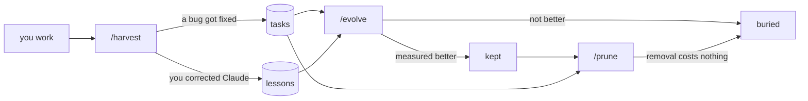
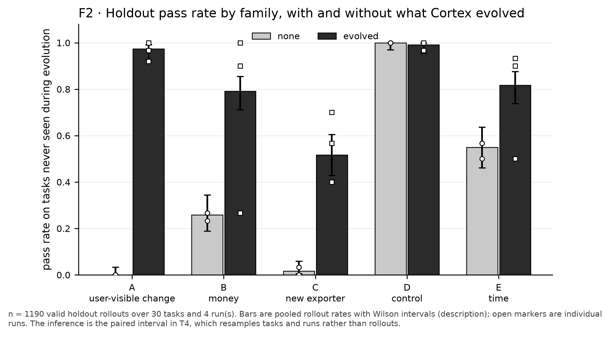

<div align="center">


<h3>Measure your Claude Code skills and rules.<br>Keep only the ones that help.</h3>

[](LICENSE) [](#requirements) [](CITATION.cff)

</div>

Most skills are written after one annoying session and never checked again. A few
months later you have dozens of them, you don't know which ones work, and every
always-on skill's description sits in the model's context on every turn.

Cortex treats each skill or rule as a hypothesis and tests it. It turns your real
sessions into tasks with a pass/fail check, proposes **one** skill or rule from the
corrections you keep making, runs Claude with and without it in isolated clones of
your repository, and keeps it only if it **wins something and breaks nothing**. It
also deletes items whose removal costs nothing, and moves items that matter in only
one part of the repo into a tier that loads only there.

## How it works

Cortex is three slash commands for Claude Code, plus a `cortex` CLI that does the
measuring.

| Command | When | Cost | What it does |
|---|---|---|---|
| **`/harvest`** | end of every session | no rollouts | Saves a bug you just fixed as a task (broken commit + your prompt + a `check.sh`), and each correction you made as a one-line lesson. |
| **`/evolve`** | weekly | 38 rollouts for 5 tasks, often far fewer | Finds the problem that recurs most in your lessons, writes one skill or rule for it, measures it, then keeps it or buries it. |
| **`/prune`** | monthly, and after a model upgrade | only the plan you approve | Measures what removing each item costs. Deletes what costs nothing, and narrows what belongs in one area. |



A **rollout** is one headless `claude -p` run of a task in a sandbox clone. `/evolve`
first screens the candidate on the tasks its lessons came from (2 runs per task, per
arm), then confirms survivors on every task (3 runs per task, per arm). The verdict
comes from `bin/score.sh`, which contains no model of any kind. A candidate is kept
only when:

- it gained something, and no single task dropped by more than one run in three;
- every task that passed every run without it still does;
- the net win is at least two runs, so one lucky run is not enough;
- the candidate actually loaded in at least one rollout.

## Does it work?

The [lab](lab/) evaluates Cortex end to end on a small Python repository with four
house rules and one control family of plain bugs, using Claude Haiku 4.5.

<p align="center"></p>

On holdout tasks never seen during evolution, the harness Cortex evolved beats no
harness by **+55.0 points** (pass rate 22% → 77%, 95% CI [+34.1, +74.1]); the control
family moves by -0.8 points. Two limits matter most: it is one synthetic repository,
and the gain belongs to a weak model. Under `claude-sonnet-5` the same harness gains
+5.6 points, because the stronger model already follows most house rules.

[One-page summary](lab/reports/SUMMARY.md) · [Full report](lab/reports/REPORT.md) ·
[Rebuild every number offline](lab/reports/REPRODUCE.md)

## Requirements

- [Claude Code](https://claude.com/claude-code) (`claude`) 2.1.276 or newer
- `git`, `jq`, `python3`, plus `timeout` (coreutils) and `flock` (util-linux)
- PyYAML is optional; Cortex has a built-in parser for its config file

## Install

```bash
git clone https://github.com/samugit83/cortex.git
cd cortex
./install.sh        # links `cortex` into ~/.local/bin, then runs `cortex doctor`
```

`cortex doctor` checks the tools above and the Claude Code version. If it says
`~/.local/bin` is not on your `PATH`, add it.

## Quick start

**1. Set up a repository** you actually work in:

```bash
cd ~/my-project
cortex init
```

This creates `.evolve/` (tasks, lessons, journal, config) and installs the three
commands into `.claude/commands/`. Commit `.evolve/`; its runtime folders are
gitignored for you.

**2. Set the two settings that matter** in `.evolve/config.yaml`, then run
`cortex config` to validate:

```yaml
baseline:
  model: claude-opus-5      # pin the rollout model, or a model change goes unnoticed
environment:
  cache_dirs:               # every build cache folder your project uses, one per line
    - __pycache__
    - .pytest_cache
```

**3. Collect for two weeks.** Work normally and run `/harvest` at the end of each
session. `nothing to harvest` is the most common answer, and a correct one.

**4. Evolve.** Once `cortex status` shows at least 3 valid tasks and a lesson has
recurred three times, run `/evolve`. The rollouts run in the background, so the
command spans a few turns and you can keep working.

**5. Prune** monthly, and always after you move to a newer model.

<details>
<summary><b>Optional: a Stop hook that reminds you to harvest</b></summary>

`hooks/log-session.sh` logs one line per session and nudges you when the session
probably produced something worth harvesting. To register it, add this to
`~/.claude/settings.json` (`install.sh` prints it with your path filled in):

```json
"hooks": {
  "Stop": [
    { "hooks": [ { "type": "command", "command": "/path/to/cortex/hooks/log-session.sh" } ] }
  ]
}
```

</details>

## Everyday CLI

| Command | What it does |
|---|---|
| `cortex status` | tasks, lessons, skills per tier, always-on context, pinned model, last cycle |
| `cortex preflight` | proves every task still fails before its fix and passes after it; quarantines the rest |
| `cortex skills` | validates every skill and rule and prints the routing table (tier, `paths`, dead globs) |
| `cortex score` | the last sweep's numbers and verdict, as JSON |
| `cortex usage` | how each skill and rule was used in your real sessions |
| `cortex doctor` | checks the environment and whether this repo's commands are current |

Everything except a sweep costs no tokens. `cortex help` lists every command; the
[guide](docs/GUIDE.md#the-commands-you-now-have) explains each one.

## What it costs

Only rollouts cost money, and each one is a full headless Claude Code session. With
the default settings and 5 tasks, a complete `/evolve` cycle is 38 rollouts (a
screen of 8, then a confirm of 30). Most cycles stop earlier: at 0 rollouts when
nothing recurred, or at 8 when the screen kills the candidate. A sweep that would
exceed `max_runs_per_cycle` (60) refuses to start, and `/prune` shows its rollouts,
time, tokens and dollars before it runs anything. In the lab, on Claude Haiku 4.5,
a rollout cost $0.125 on average; a stronger model costs more.

## Optional: Jev

Cortex is complete without it. [Jev](docs/JEV.md) is an optional calibrated judge
that helps Cortex *propose*: which problem recurs, which tier a change belongs in,
which tasks a candidate is really about. It is never on the verdict path: the
scorer, the sweep and preflight contain no Jev code, and a test asserts it. To turn
it on, copy `.env.example` to `.env` in this directory and paste your key (the copy
already sets `JEV_ENABLED=1`), then run `cortex doctor`.

## Documentation

| Read | For |
|---|---|
| [**docs/GUIDE.md**](docs/GUIDE.md) | the complete guide: each command step by step, tiers and routing, task anatomy, isolation, every `cortex score` field, the configuration reference |
| [docs/THEORY.md](docs/THEORY.md) | why Cortex is built this way, principle by principle |
| [docs/TROUBLESHOOTING.md](docs/TROUBLESHOOTING.md) | every known failure mode and its fix |
| [docs/JEV.md](docs/JEV.md) | the optional judge: what it is asked and exactly what leaves your machine |
| [lab/README.md](lab/README.md) | how the evaluation lab is built |

## Repository layout

```
bin/          the cortex CLI: sweep, score, preflight, harness and config tools
commands/     /harvest, /evolve, /prune, copied into each repo by `cortex init`
hooks/        the optional Stop hook
templates/    the task folder template
docs/         guide, theory, troubleshooting, Jev
jev/          the evidence and validation gate behind the optional judge
lab/          the evaluation lab, its report and its data
test/         the test suite: ./test/run-tests.sh (no API calls)
diagram/      visual overviews, as HTML pages
```

## Citation

If you use Cortex or its data, please cite it. GitHub's **Cite this repository**
button reads [`CITATION.cff`](CITATION.cff).

## License

[MIT](LICENSE) © 2026 Samuele Giampieri
