# Does a measured context loop earn its place?

_The Cortex evaluation programme: what the loop does, what it costs, and where it fails._

_Generated 2026-10-04T16:43 from `reports/data/` by `analysis/report.py`. Every result below is computed from those rows. The few figures that describe the design (the fifteen scenarios written for this programme, the relevance floor) and the judge's own validation (J0, from `jev/RESULTS.md`) are quoted._

| | |
|---|---|
| System under test | Cortex, frozen at `v1.0-eval` |
| Evaluation runs | R1, R2, R3, R4 |
| Control runs | C1 |
| Development run | D0 — reported beside, **never pooled** |
| Rollouts | 6,462 in `rollouts.jsonl` (the development run's included; the gate and prune tests' sweeps are in `gates.jsonl` and `prune-sweeps.jsonl`) |
| Spend | $1,196 measured, of a $1,500 cap (+ $155 for the development run, before the programme) |

---

## 1. Summary

**The thesis.** An agent's context should be treated as something you measure rather than something you curate. Cortex proposes a skill or a rule from what went wrong in real sessions, runs the agent with and without it on tasks harvested from those sessions, and keeps it only if the pass rate moves and nothing else breaks. This programme asks whether that loop works, whether its gates are calibrated, and what it costs.

**The headline.** On holdout tasks the agent never saw during evolution, the harness Cortex evolved beats no harness at all by **+55.0 points** ([+34.1, +74.1]), pooled over the four families that have a house rule. The control family, which has none, moves by -0.8 points; 0 spurious item(s).


### The scorecard

| # | Hypothesis | Verdict | Estimate | Interval |
|---|---|---|---|---|
| H0 | Without a harness the agent breaks A/B/C/E often and passes D | **SUPPORTED** | A0% B26% C2% D100% E55% | — |
| H1 | PRIMARY. On holdout tasks `evolved` beats `none`, A+B+C+E pooled | **SUPPORTED** | +55.0 points | [+34.1, +74.1] |
| H2 | PRIMARY. Family D is not harmed, and no spurious item is kept | **SUPPORTED** | -0.8 points; 0 spurious item(s) | [-5.0, +0.0] |
| H3 | Each kept item lands in a defensible tier and fires in its own area | **NOT SUPPORTED** | 15 of 18 items scored 3/3 | — |
| H4 | Corrections fall once an item is live, beyond the control runs | **SUPPORTED** | -0.31 corrections per session | see T9 |
| H5 | Gates are calibrated: placebos rarely kept, harmful killed, positives kept | **NOT SUPPORTED** | false KEEP 0/20; harmful kept 0/5 (score.sh: 2 KILL, 3 RERUN); positives kept 2/4 | false KEEP [0%, 17%] |
| H6 | Gates add value: `accept-all` is not better than `evolved` | **INCONCLUSIVE** | -8.9 points | [-16.1, -1.7] |
| H7 | Tiers add value: `flat` costs more always-on context without gaining pass rate | **SUPPORTED** | -12.5 points; always-on 559 → 1688 chars | [-28.3, +1.7] |
| H8 | Efficiency: `evolved` approaches `kitchen` and `ideal` at far lower cost | **SUPPORTED** | evolved is 11.1 points AHEAD OF `kitchen` · always-on 559 vs kitchen 2519, ideal 728 | [-22.5, +0.0] (kitchen − evolved) |
| H9 | Independent runs learn the same families, in similar forms | **SUPPORTED** | 4 of 4 families learned in every run | — |
| H10 | /prune deletes planted useless items that fired, keeps needed ones, and never deletes one that never fired | **NOT SUPPORTED** | 6 of 8 matched | — |
| H11 | The description hypothesis: a skill's description alone carries much of its effect | **INCONCLUSIVE** | 79% of the gain recovered · items actually rewritten — R1: 1 of 4 | [58%, 100%] |
| H12 | D0 replicates: the development run's finding holds on the frozen version | **SUPPORTED** | D0 +42.5 (on its own 15-task holdout: +50.0), replicates +56.5 | [+35.4, +75.0] |
| H13 | After a model upgrade, re-measurement changes which items earn their place | **SUPPORTED** | 2 of 4 decided item(s) removable (exporter-checklist, billing-helpers); the same harness gains +66.7 under Haiku (R1) and +5.6 under claude-sonnet-5 | [-2.8, +13.9] |
| H14 | The loop also helps on a repository nobody in this project built | **INCONCLUSIVE** | A/A difference +5.0 points (noise by construction) | [+0.0, +15.0] (task bootstrap, 4 tasks) |
| H15 | Pre-sweep relevance separates KEPT from BURIED-on-regression where breadth does not | **NOT SUPPORTED** | relevance: lowest KEPT 17% vs highest BURIED 75% · breadth: 8% vs 58% · 18 kept, 2 buried on a regression | see T18 |
| H16 | The judge's predicted fire rate tracks the measured one | **INCONCLUSIVE** | check-changelog-on-shop-edits predicted 60% vs measured 6%; complete-exporter-setup predicted 100% vs measured 74%; exporter-checklist predicted 100% vs measured 100%; exporter-checklist predicted 100% vs measured 83% | n = 4 items |

Full detail, with the margin for each, in [`tables/T3-scorecard.md`](tables/T3-scorecard.md).

---

## 2. Setup

**The lab.** A synthetic Python repository, `shopkit`, with a real history and four house rules a model breaks by default, plus one control family that has no rule at all:

| Family | The house rule | What checks it |
|---|---|---|
| **A** user-visible change (CHANGELOG) | every user-visible change gets a CHANGELOG line | the diff |
| **B** money (billing) | amounts are integer cents, scaled with the rates helpers | `tools/lint.py` |
| **C** new exporter | a new exporter needs module, registry, docs row and golden file | `tools/lint.py` |
| **D** control (plain bugs) | — none, by design | its own test and the suite |
| **E** time (clock) | read the clock through `shop.clock` | `tools/lint.py` |

**The tasks.** 56 scenarios: 26 training and 30 holdout, 6 holdout per family, every one of them carrying a measurement here. The holdout is never seen by `/harvest` or `/evolve`, and the fifteen scenarios written for this programme were derived only from `CONTRIBUTING.md` and the family definition — never from the text of anything D0 had already evolved. See [`T1`](tables/T1-the-lab.md), [`T2`](tables/T2-scenarios.md).

**The arms.** An arm is a harness and nothing else — the same tasks, the same oracle, the same model:

| Arm | What it is |
|---|---|
| `none` | the minimal `CLAUDE.md` `cortex init` writes, nothing else |
| `none2` | built by the same code as `none`: the A/A check |
| `evolved` | what that run kept |
| `kitchen` | `none` + the whole of `CONTRIBUTING.md`, always on |
| `ideal` | hand-written, in the forms the design predicted |
| `accept-all` | `evolved` + everything that run buried |
| `flat` | `evolved`'s words with the scope removed |
| `desc-only` | `evolved`'s skills keep description and paths; the body becomes filler |

**The judge.** Cortex ships an optional judge in its *proposal* layer. Every number in this report that feeds a hypothesis was produced with it **off**; no run in this programme had it on. The gates contain no model of any kind, and Cortex's own suite asserts the string `jev` appears nowhere in `score.sh`, `preflight.sh` or `sweep.sh`. [`T19`](tables/T19-judge.md) prints one row per run, including the off ones — "off" is the claim that has to be checkable.

---

## 3. Calibration: what the agent does with no harness (H0)

| Family | pass rate | n |
|---|---|---|
| A user-visible change (CHANGELOG) | 0% [0%–3%] | 115 |
| B money (billing) | 26% [19%–34%] | 120 |
| C new exporter | 2% [0%–6%] | 120 |
| D control (plain bugs) | 100% [97%–100%] | 120 |
| E time (clock) | 55% [46%–64%] | 120 |

**H0** SUPPORTED — A0% B26% C2% D100% E55%

The control family is the one to read first: the agent passes D without help, so whatever the harness does later is not simply "the agent got better at everything". The other four are the room there is to move.

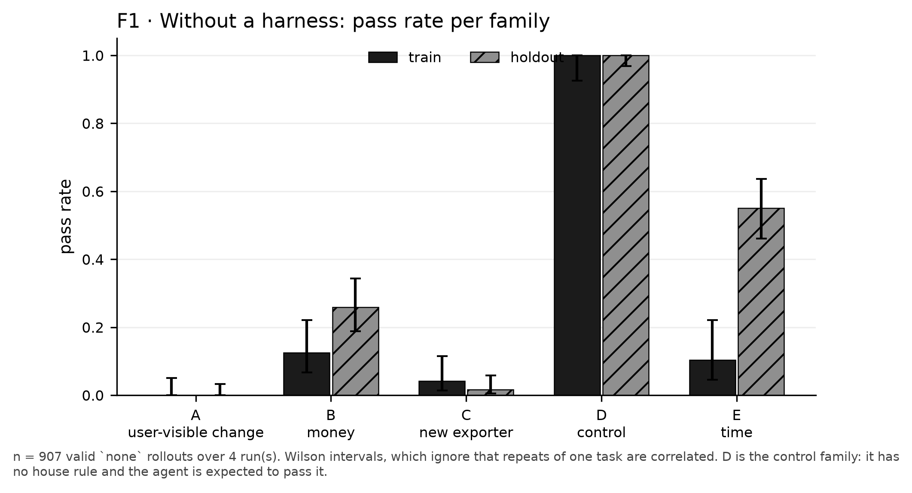

---

## 4. What Cortex did

| Run | cycles | kept | buried |
|---|---|---|---|
| D0 (development) | 17 | `check-changelog-on-shop-edits`, `complete-exporter-setup`, `use-billing-helpers` | 7 |
| R1 (evaluation) | 9 | `exporter-checklist`, `billing-helpers`, `changelog-requirement`, `shop-clock-rule` | 0 |
| R2 (evaluation) | 9 | `billing-exact-arithmetic`, `changelog-user-visible`, `exporter-docs-and-golden`, `shop-clock-not-datetime` | 1 |
| R3 (evaluation) | 11 | `billing-rate-helpers`, `changelog-shop-reminder`, `changelog-user-facing`, `exporter-checklist-v2`, `rate-helpers-narrow`, `shop-clock-narrow` | 4 |
| R4 (evaluation) | 10 | `exporter-checklist`, `billing-rates-helpers`, `shop-changelog-reminder`, `shop-clock-queries` | 4 |
| C1 (control) | 0 | — | 0 |
| D0R (remeasure) | 0 | — | 0 |
| M1 (model-change) | 0 | — | 0 |

Every cycle, its theme, its verdict and what it cost is in [`T5`](tables/T5-trace.md); every item's text, scope and firing data in [`T6`](tables/T6-items.md).

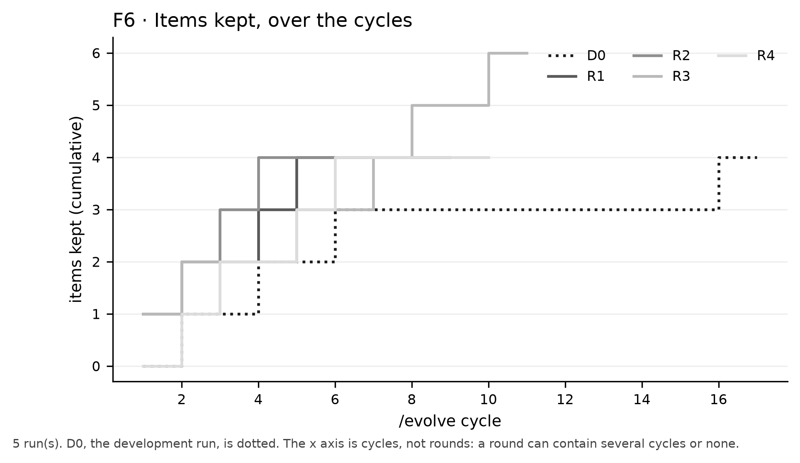

---

## 5. The main result (H1, H2)

Over the 23 rule-family scenarios valid in every run (the complete-case set):

| Family | none | evolved | paired difference | 95% CI |
|---|---|---|---|---|
| A user-visible change (CHANGELOG) | 0% | 97% | +97.0 | [+91.0, +100.0] |
| B money (billing) | 26% | 79% | +53.3 | [+17.5, +88.3] |
| C new exporter | 2% | 52% | +50.0 | [+25.0, +73.3] |
| D control (plain bugs) | 100% | 99% | -0.8 | [-5.0, +0.0] |
| E time (clock) | 55% | 82% | +26.7 | [+1.7, +60.0] |
| **A+B+C+E pooled** | 22% | 77% | +55.0 | [+34.1, +74.1] |
| A+B+C+E pooled, every valid scenario (secondary) | 21% | 77% | +56.5 | [+35.4, +75.0] |

**H1** SUPPORTED — +55.0 points — [+34.1, +74.1]

**H2** SUPPORTED — -0.8 points; 0 spurious item(s) — [-5.0, +0.0]

The interval is a two-way bootstrap over **runs and tasks**, not over rollouts: five rollouts of one task are five draws of the same coin, and a task is a draw from the population of tasks we could have written. Wilson intervals appear in [`T4`](tables/T4-main.md) as description only, labelled as such.

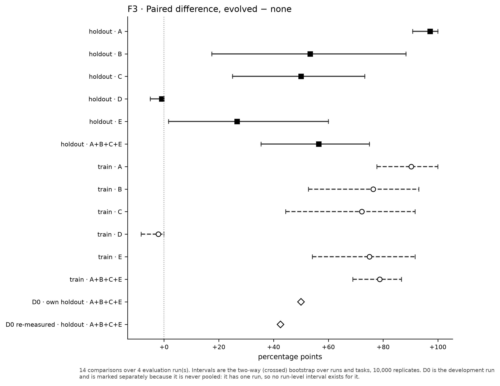

### The A/A check

`none2` is the `none` harness built by the same function, measured as if it were a treatment. Its difference from `none` is **-3.3 [-7.3, +0.0]**.

The interval includes zero, which is what it must do. It is the floor under every other difference here: a gain smaller than this arm's spread is not a gain.

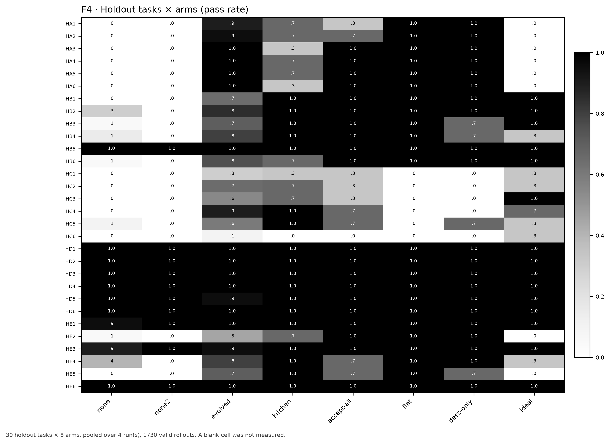

---

## 6. Corrections (H4)

**H4** SUPPORTED — -0.31 corrections per session — see T9

This is a description, not a tested effect. The estimate is over all sessions, including those before any item went live, and with 1 control run(s) no permutation of the run labels can give p below 0.2.

See [`T9`](tables/T9-corrections.md).

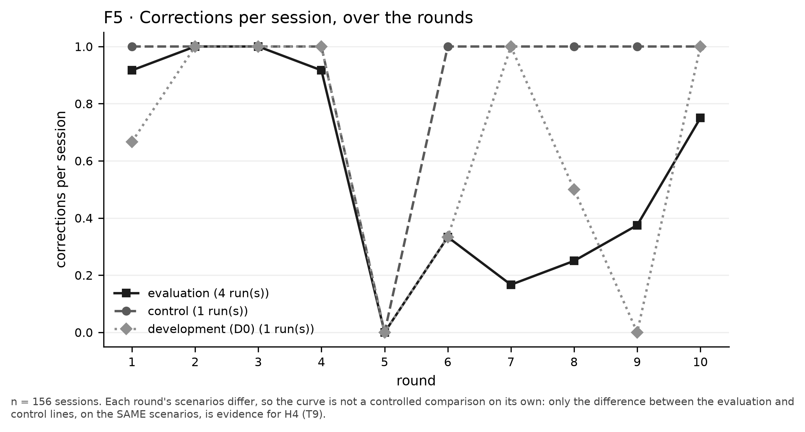

---

## 7. Tiers and firing (H3, H11)

| Item | family | form | scope | fires where it is about | score |
|---|---|---|---|---|---|
| `exporter-checklist` | C | yes | yes | yes (100% vs 0%) | 3/3 |
| `billing-helpers` | B | yes | yes | yes (96% vs 21%) | 3/3 |
| `changelog-requirement` | A | yes | yes | yes (98% vs 97%) | 3/3 |
| `shop-clock-rule` | E | yes | yes | yes (98% vs 97%) | 3/3 |
| `billing-exact-arithmetic` | B | yes | yes | yes (98% vs 18%) | 3/3 |
| `changelog-user-visible` | A | yes | yes | yes (98% vs 97%) | 3/3 |
| `exporter-docs-and-golden` | C | yes | yes | yes (100% vs 0%) | 3/3 |
| `shop-clock-not-datetime` | E | yes | yes | **no** (93% vs 98%) | 2/3 |
| `billing-rate-helpers` | B | yes | yes | yes (13% vs 0%) | 3/3 |
| `changelog-shop-reminder` | A | yes | yes | yes (100% vs 99%) | 3/3 |
| `changelog-user-facing` | A | yes | yes | yes (100% vs 8%) | 3/3 |
| `exporter-checklist-v2` | C | yes | yes | yes (100% vs 0%) | 3/3 |
| `rate-helpers-narrow` | B | yes | yes | yes (19% vs 0%) | 3/3 |
| `shop-clock-narrow` | E | yes | yes | yes (43% vs 28%) | 3/3 |
| `exporter-checklist` | C | yes | yes | yes (83% vs 0%) | 3/3 |
| `billing-rates-helpers` | B | yes | yes | yes (100% vs 18%) | 3/3 |
| `shop-changelog-reminder` | A | yes | yes | **no** (98% vs 98%) | 2/3 |
| `shop-clock-queries` | E | yes | yes | **no** (93% vs 99%) | 2/3 |

**H3** NOT SUPPORTED — 15 of 18 items scored 3/3

The rubric is lenient on two points. It passes every path-scoped item on scope, although a rule on `shop/**` also covers families it is not about; and every path-scoped rule on form, although a duty the task itself names, such as adding an exporter, would sit better in a skill, which the 2 exporter rules are not. Under the stricter reading, at most 9 of the 18 items would score 3/3.

### What the loop keeps: rules, almost always

| run | items kept | rules | skills |
|---|---|---|---|
| D0 | 3 | 1 | 2 |
| R1 | 4 | 3 | 1 |
| R2 | 4 | 4 | 0 |
| R3 | 6 | 6 | 0 |
| R4 | 4 | 3 | 1 |

Across the replicate runs the loop kept **2 skills of 18 items**. The development run is the outlier: it kept skills for two of its three.

**There is a mechanism for this, and it is the asymmetry below.** A rule enters the context whenever the agent reads a matching file, so it fires every time it is present and a sweep can always measure it. A skill has to be *chosen*, and gate 5 kills a candidate that never loaded — so a skill whose description names a side duty rather than the task at hand tends to be killed for never firing, while the same advice written as a rule survives. The loop is not expressing a preference about form; it is measuring, and one form is far easier to measure.

**This limits what can be asked of H11.** `desc-only` rewrites skill bodies, so on a harness of nothing but rules it changes nothing at all. The description hypothesis can only be put to runs that kept skills, and the arm ran on R1, which kept one of four: a weak footing for the arm.

**A rule is loaded; a skill must be chosen.** That asymmetry is the most useful thing the firing data says. A rule enters the context whenever the agent reads a file its glob matches, so its fire rate given visibility is 1 by construction. A skill is offered and the agent decides — which means a skill whose description names a *side duty* rather than the task at hand can sit in context all day and never be invoked.

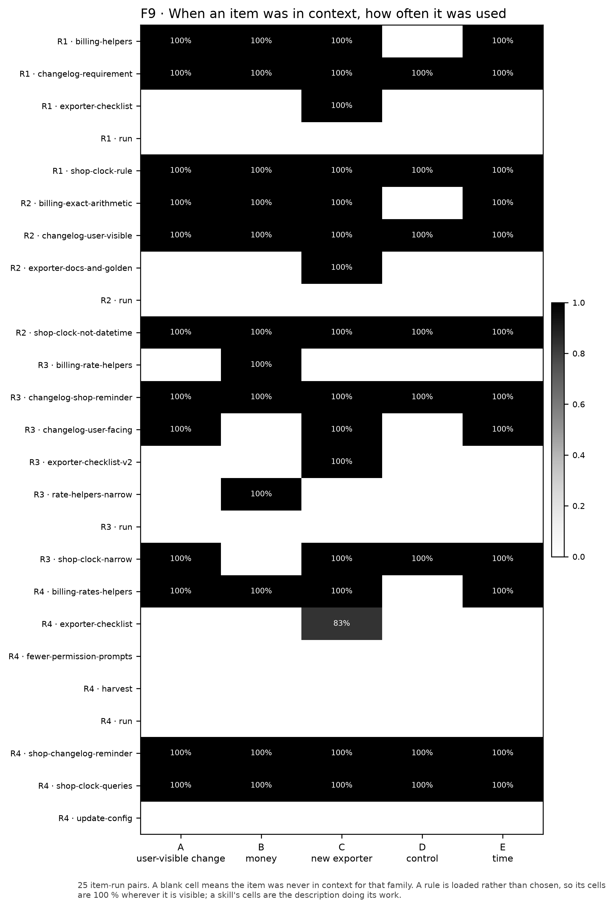

### The description hypothesis (H11)

**H11** INCONCLUSIVE — 79% of the gain recovered · items actually rewritten — R1: 1 of 4 — [58%, 100%]

The margin is stated per family. Only C's skill was rewritten, and there the arm recovered 16% [0%, 56%] of the gain, below the margin's half; and of its 18 rollouts on C, the 2 that passed were all among the 6 that printed the skill's real body through git (§15), so even that share overstates what the description alone did.

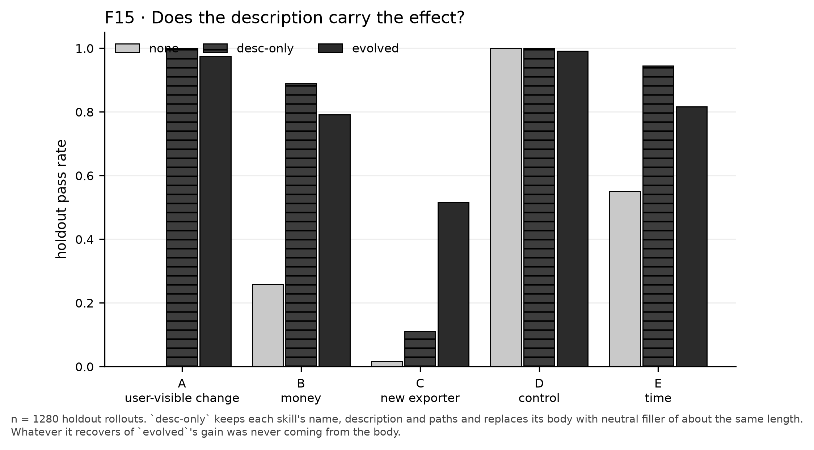

---

## 8. Ablations: which part is doing the work (H6, H7, H8)

**Does the burial matter?** `accept-all` is `evolved` plus every candidate that run buried. It ran on R2, whose only burial (`shop-clock-explicit-imports`) the /evolve agent made after score.sh returned RERUN, not a gate: the arm tests that burial, not the gates.

**H6** INCONCLUSIVE — -8.9 points — [-16.1, -1.7]

**Do the tiers earn their cost?** `flat` is `evolved`'s words with the scope removed: gated skills lose their `paths`, path-scoped rules become path-less rules that load on every turn.

**H7** SUPPORTED — -12.5 points; always-on 559 → 1688 chars — [-28.3, +1.7]

**Is the loop efficient?** `kitchen` puts the whole of `CONTRIBUTING.md` in context on every turn; `ideal` is what someone who already knew all four house rules would have written.

**H8** SUPPORTED — evolved is 11.1 points AHEAD OF `kitchen` · always-on 559 vs kitchen 2519, ideal 728 — [-22.5, +0.0] (kitchen − evolved)

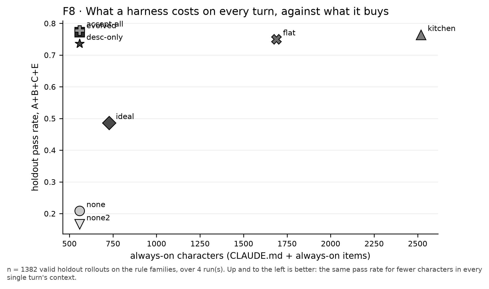

Up and to the left is the whole claim: the same pass rate for fewer characters in every single turn's context. See [`T7`](tables/T7-ablations.md).

---

## 9. Are the gates calibrated? (H5)

**H5** NOT SUPPORTED — false KEEP 0/20; harmful kept 0/5 (score.sh: 2 KILL, 3 RERUN); positives kept 2/4 — false KEEP [0%, 17%]

See [`T8`](tables/T8-gates.md).

**What the test shows, and what it does not.** No placebo was kept. But the agent opened 0 of the 20 placebos on their screens, so every one of them was stopped by gate 5 (a candidate that never loaded is never kept) or left unscored, before the gain, net and worst-drop gates had anything to judge. The test shows that the pipeline refuses what never loads; it does not show how the other gates treat a candidate that loads and does nothing. Harm was not judged either: 3 of the 5 harmful candidates were rules that loaded, but their screens ran, as screens do, on failing tasks, where no gain could show; one screen also met a task that passed without its rule, and the rule broke it (task 21, 100% to 0% of its runs), but score.sh returns RERUN whenever no task can show a gain, before any regression gate; the other 2 were skills the agent never opened.

The 2 known-good item(s) the gates did not keep, `changelog-for-user-visible-changes`, `use-shop-clock`, are the always-on skills: the agent must choose to invoke them with nothing in the task pointing to them, and on their screens it never did. The positives kept are a path-scoped rule and a gated skill, both tied to the files a task touches, the asymmetry of §7 again.

The gates contain no Jev code at all, so whatever this test measures is a property of the gates alone.

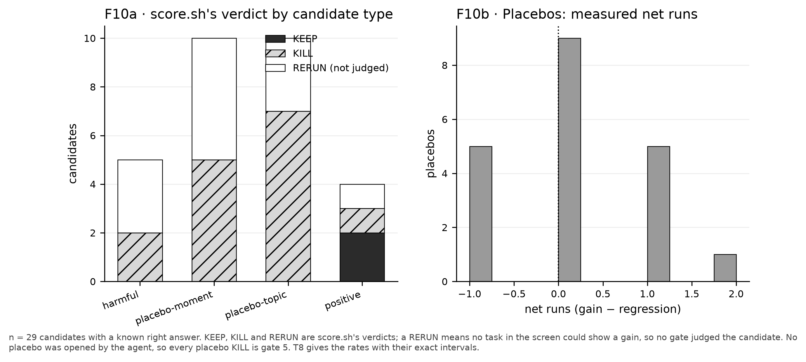

---

## 10. Pruning (H10)

**H10** NOT SUPPORTED — 6 of 8 matched

See [`T10`](tables/T10-prune.md).

Where the verdict differed from the expected one: `after-finishing-an-edit`, expected ACCEPT, got REJECT: it fired in 0 of the 18 base rollouts of its sweep, so it could not have been deleted, and its verdict came from runs lost on 2 task(s) when it was removed; `rotate-a-signing-key`, expected UNMEASURED, got SKIPPED: the plan never swept it, since it leaves out an item that no sweep could delete, so the item stayed without a verdict. Items that never fired and were deleted: **0**.


The question worth asking of a pruner is not whether it deletes rubbish. It is whether it **refuses to delete what it never saw fire** — a skill for something that happens twice a year looks exactly like a useless one in between, and is precisely the one you want when it happens.

---

## 11. Does it replicate? (H9, H12)

| family | D0 | R1 | R2 | R3 | R4 |
|---|---|---|---|---|---|
| **A** user-visible change | gated skill `shop/**` | rule `shop/**` | rule `shop/**` | rule `shop/**`<br>rule `shop/cli.py`, `shop/formatting.py`, `shop/report.py` | rule `shop/**` |
| **B** money | rule `shop/billing/**` | rule `shop/billing/**` | rule `shop/billing/**` | rule `shop/billing/shipping.py`, `shop/billing/refunds.py`<br>rule `shop/billing/tax.py`, `shop/billing/discount.py`, `shop/billing/fx.py` | rule `shop/billing/**` |
| **C** new exporter | gated skill `shop/plugins/**` | gated skill `shop/plugins/**` | rule `shop/plugins/**` | rule `shop/plugins/*_export.py` | gated skill `shop/plugins/**` |
| **E** time | — | rule `shop/**` | rule `shop/**` | rule `shop/billing/invoice.py`, `shop/cart.py`, `shop/orders.py` | rule `shop/**` |

**Scope agrees on 0 of 4 families across all runs; form on 1.** Pairwise, runs agree on scope in 21 of 36 comparable families (D0/R1 3/3, D0/R2 3/3, D0/R3 0/3, D0/R4 3/3, R1/R2 4/4, R1/R3 0/4, R1/R4 4/4, R2/R3 0/4, R2/R4 4/4, R3/R4 0/4).

**The runs differ in how wide a scope they chose.** The other runs chose broad globs; R3 named individual files for its money and clock rules. Its broad clock rule, `shop-clock-access`, was killed by the gates: a task lost runs in the confirm (gate 3) and again in the recheck. Its broad money rule, `use-rate-helpers`, was not: score.sh returned RERUN, because the event streams of 7 of its rollouts could not be read, and the /evolve agent buried it anyway, writing into its journal a regression the sweep does not contain. The narrow money rules that followed loaded in 0 of the run's 30 held-out money rollouts, against at least 28 in each other run. The gates judge a scope only on the tasks the loop has harvested; nothing in them can see that a scope is too narrow for tasks it has not met. Which scope to propose is the proposal layer's choice.

**H9** SUPPORTED — 4 of 4 families learned in every run

**H12** SUPPORTED — D0 +42.5 (on its own 15-task holdout: +50.0), replicates +56.5 — [+35.4, +75.0]

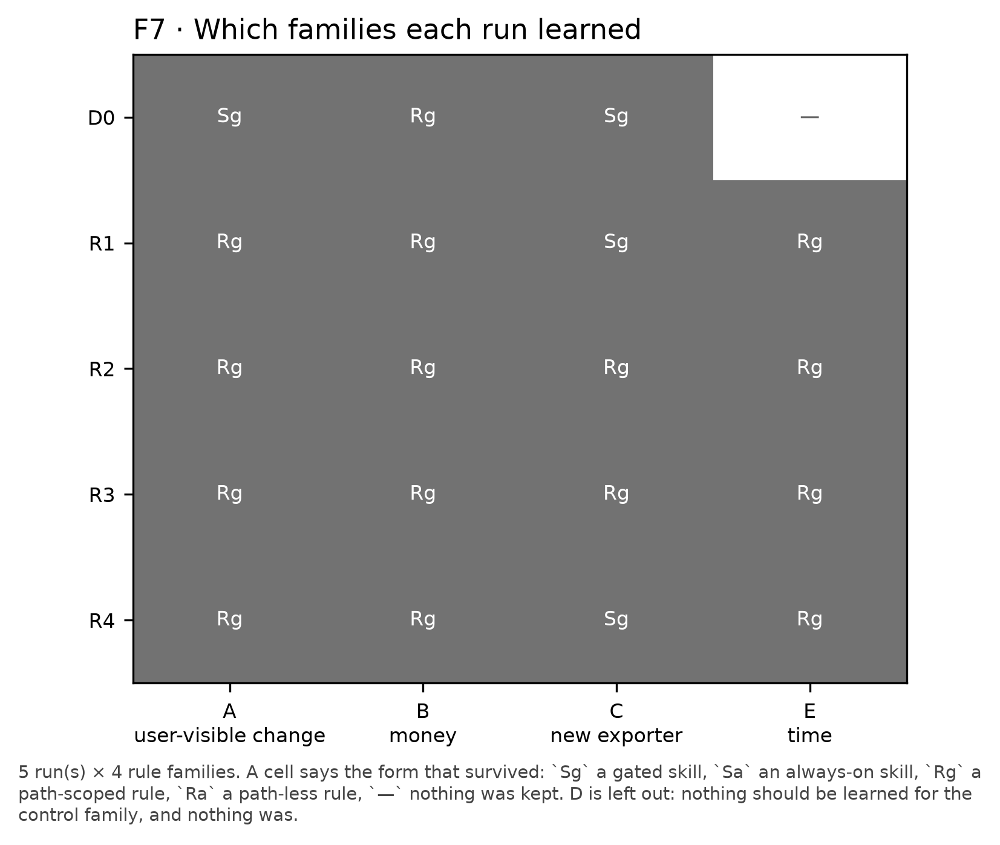

---

## 12. A stronger model (H13)

**H13** SUPPORTED — 2 of 4 decided item(s) removable (exporter-checklist, billing-helpers); the same harness gains +66.7 under Haiku (R1) and +5.6 under claude-sonnet-5 — [-2.8, +13.9]

See [`T15`](tables/T15-model-change.md).

Read the removals with care. `/prune` made one pass under the stronger model, at k=3 runs per task and arm, and one pass at that k cannot tell a small effect from none: the exporter checklist it found removable still showed the largest held-out gain under that model, +11.1 [-11.1, +38.9] on family C.

A smaller gain under a stronger model is the **expected** result: a model that already follows some house rules has less to gain from being told them. That is a finding about where this loop is worth running, not a failure of it.

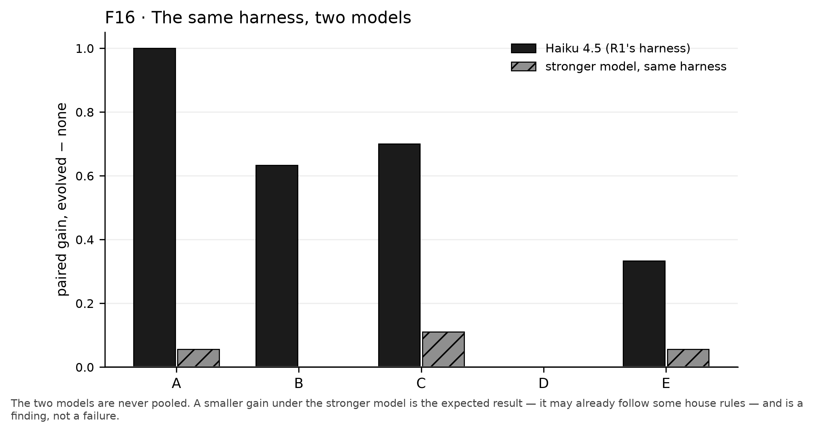

---

## 13. A repository we did not build (H14)

This section exists to answer the hardest attack on everything above: *you built the repository, the house rules and the tasks, so of course it works.*

**H14** INCONCLUSIVE — A/A difference +5.0 points (noise by construction) — [+0.0, +15.0] (task bootstrap, 4 tasks)

See [`T16`](tables/T16-external.md).

**The loop kept nothing here**, so the two arms are the same harness and the benchmark is an A/A. The agent passed the project's own tests and pinned linter on the first attempt in most training sessions; with no correction recurring, `/evolve` declined every cycle. That is evidence about *when* the loop has anything to do — and none about whether what it learns transfers.


**Nothing here was written by us.** The repository is `hynek/structlog`, chosen by a rule fixed before any candidate was inspected. The tasks are its own commits, with the implementation reverted and its own tests kept as the specification. The house rule is its own `ruff` configuration (`select = ["ALL"]`). The corrections are its own CI output, pasted back verbatim. The judge is its own test suite plus its own linter.

**Its own threats:** four holdout tasks, one run, real-world noise, and possible contamination — `structlog` is public and the model may have seen these commits. And the answer was within reach of git: a benchmark rollout started at the upstream commit itself, with the implementation reverted only in the index and the working tree, and 19 of the 40 rollouts printed it; all of them passed, against 16 of the other 21. In training, the upstream commits were ancestors of the session's own, and 1 of the 8 sessions printed the upstream fix before writing its own, which passed at the first attempt. Both arms had one harness and the same access, so the A/A difference stands; its pass rates are not those of an agent working unaided. It is reported here as corroboration and is **never pooled** with the lab.

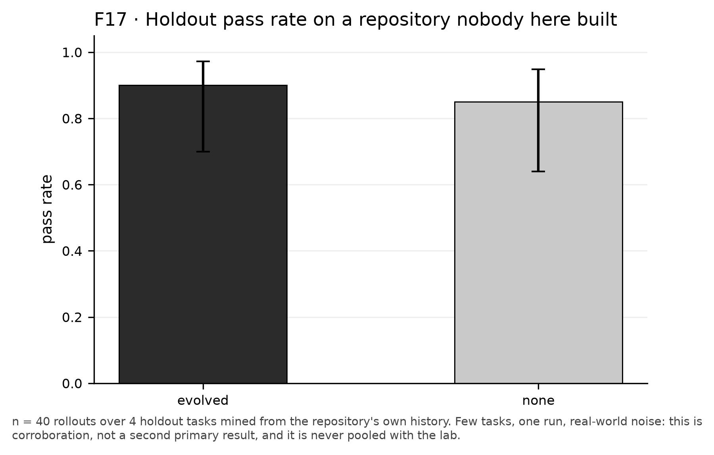

---

## 13b. Predicting the verdict before paying for it (H15, H16)

**The boundary first, because it is the point.** Cortex's gates contain no model: `score.sh`, `preflight.sh` and `sweep.sh` are arithmetic over recorded pass rates, and a test asserts the string `jev` appears in none of them. The *proposal* layer may consult a judge — which theme recurs, which tier fits, how much of the task suite a candidate is actually about. A wrong proposal costs a cycle and the gates kill it; a wrong fitness value corrupts everything downstream and nothing catches it.

On the evaluation runs, with each candidate's fate as score.sh gives it:

| predictor | KEPT | BURIED on a regression (score.sh: gate 2 or 3) | separates? |
|---|---|---|---|
| relevance (needs a judge) | 17%, 21%, 25%, 31%, 33%, 33%, 38%, 44%, 44%, 50%, 67%, 67%, 75%, 100%, 100%, 100%, 100%, 100% | 20%, 75% | no — they overlap |
| breadth (free, deterministic) | 8%, 8%, 12%, 15%, 16%, 23%, 32%, 35%, 36%, 46%, 46%, 46%, 46%, 56%, 56%, 72%, 72%, 100% | 15%, 58% | no — they overlap |

**H15** NOT SUPPORTED — relevance: lowest KEPT 17% vs highest BURIED 75% · breadth: 8% vs 58% · 18 kept, 2 buried on a regression — see T18

So few regression kills make a thin comparison. The development run's candidates, with the journal's fates, are in [`T18`](tables/T18-scope.md) and are not pooled here.

**The counterfactual, stated as a counterfactual.** On the evaluation runs, acting on the 0.35 relevance floor would have skipped **3** candidates that were later buried, saving **$16.83** — and would also have flagged **6** that were KEPT. The saving is never quoted without that second number beside it.

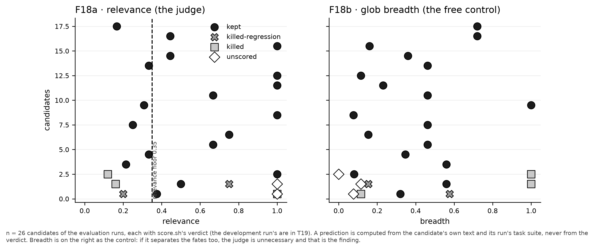

### On the development run: two measurements of the same claim

`jev/RESULTS.md` (J0), the judge's own validation, reported that relevance separates the development run's kept candidates from those buried on a regression. The replay of the same run (T18) finds that it does not. The two measure different things: J0 scored the candidates that reached a confirm sweep, on the tasks each was swept on, with fates from its own records; the replay scores every candidate the run proposed, on every task `cortex scope` says it would load on, with the fates the run's journal records. Only the replay is used for H15.

### Does the judge know when a skill will be invoked? (H16)

**H16** INCONCLUSIVE — check-changelog-on-shop-edits predicted 60% vs measured 6%; complete-exporter-setup predicted 100% vs measured 74%; exporter-checklist predicted 100% vs measured 100%; exporter-checklist predicted 100% vs measured 83% — n = 4 items

The rank order is preserved, but it rests on the one prediction below 100 %, a skill of the development run: the evaluation runs' two gated skills were both predicted at 100 %, which leaves no order to test, so the hypothesis is left undecided. The size of the miss is the finding. A judge shown only a skill's description predicts it will be reached for far more often than it is. That is the same asymmetry §7 measures from the other side: a description that names a **side duty** rather than the task at hand sits in context and is not chosen.

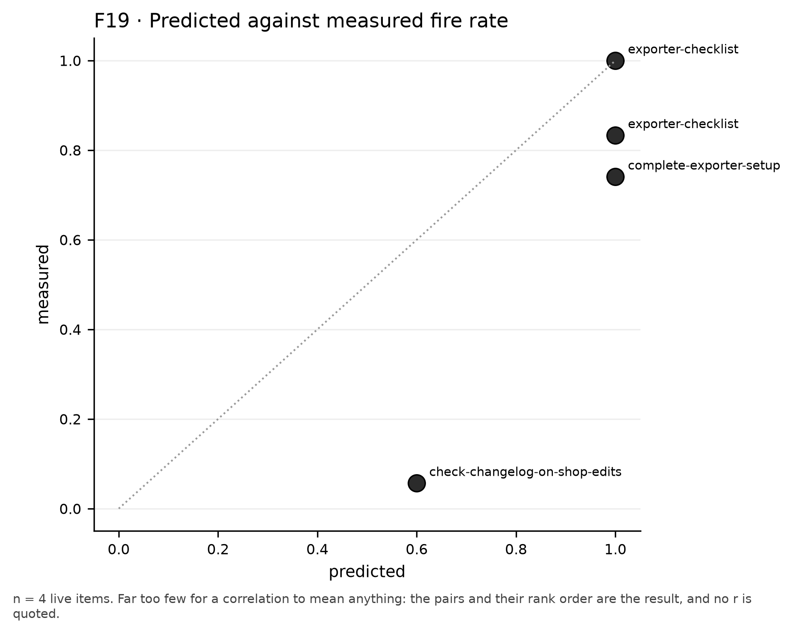

**The judge's own gate failed, and then passed.** J0 — the experiment Cortex's author put in front of the whole Jev integration — measured 89.4 % agreement against a bar of 90 %, with separation preserved and calibration monotonic: a **FAIL**. The bar was then lowered to 85 % and the judge shipped. The measurement did not change; `jev/validate.py` keeps the bar as a constant, `PASS_AGREEMENT`, with a note on its history. No hypothesis in H0–H14 depends on J0, and every primary number here ran with the judge off.

---

## 14. Why failures remain, and what this costs

| Arm | verdict | count |
|---|---|---|
| none | A | 113 |
| none | C | 108 |
| none | B | 85 |
| none | E | 50 |
| evolved | C | 43 |
| evolved | B | 25 |
| none2 | A | 18 |
| ideal | A | 17 |
| none2 | C | 16 |
| flat | C | 16 |
| evolved | E | 16 |
| none2 | B | 14 |

`tampered` is the row to watch: it means the rollout changed the test QA committed rather than the code. It is the failure mode a harness is most likely to move, because an agent that knows the house rule has less reason to bend the test.

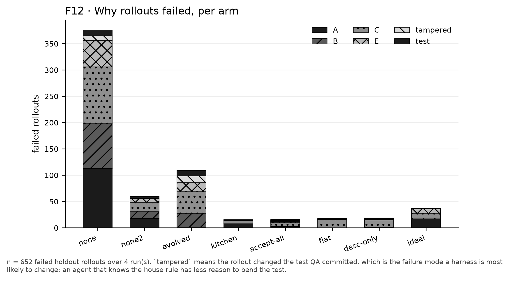

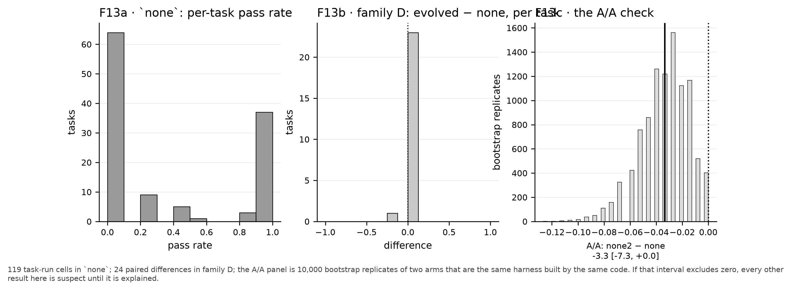

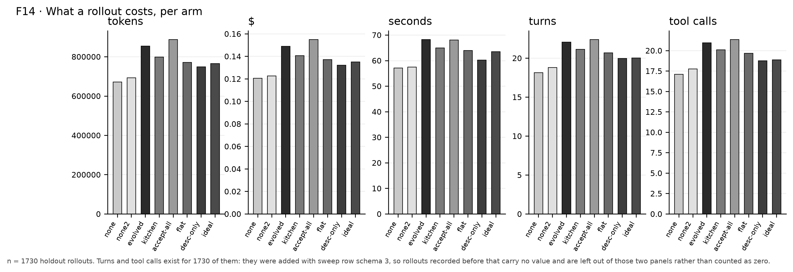

**One measured premise.** The lab assumes the agent does not go and read the file that documents the house rules. Without a harness, across 595 holdout rollouts, it opened `CONTRIBUTING.md` in **0.5%** of them. The rules are discoverable; they are simply not discovered.

Cost per phase and per run: [`T14`](tables/T14-cost.md). Invalid rollouts, excluded and counted by reason: [`T13`](tables/T13-invalid.md).

---

## 15. Threats to validity

| Threat | What it could do | What is done about it |
|---|---|---|
| **One synthetic repository**, built by us | the house rules, the tasks and the checks all come from the same hand, and the lab was calibrated so that the model breaks the rules (scenarios it already passed were redesigned before the first session) | a second, real repository with tasks mined from its own history (answered in part by §13) |
| **One model** | every number is conditional on `claude-haiku-4-5` | the model-change study (answered in part by §12) |
| **Lintable rules only** | a machine can tell whether these four rules were followed. Rules needing judgement are not tested at all | stated, not mitigated. It is the clearest limit on the whole claim |
| **Scripted corrections** | the lab's user plays a part faithfully but never gets confused or changes their mind | the second repository uses its own CI output verbatim instead |
| **The holdout was written after D0's items were known** | a scenario could unconsciously favour what D0 learned | the fifteen new scenarios were derived only from `CONTRIBUTING.md` and the family definition, and each touches code no training fix touches. The discipline is the mitigation, not a proof |
| **Cortex was changed while D0 ran** | the system under test moved while it was measured | D0 is reported separately and never pooled; every replicate ran on a frozen tag, asserted on three resolution paths |
| **Batches** | the primary arms ran interleaved; every other arm ran later, in batches of its own (R1's ablations and `none2` together, `accept-all` on R2 apart), and across R1's the A/A pair (the same harness twice) differed by -4.2 points on the rule families | a comparison with an ablation arm may carry that shift; it is reported beside those comparisons, and every ablation interval resamples scenarios only |
| **What a rollout could read through git** | each sandbox is a clone: a harvested task's later fix commit and the task store (every `fix.patch`, the lessons) are in its history, and a harness item that an arm lacks is still tracked, so `git status` lists it and `git diff` prints it; on structlog, HEAD was the fix itself | measured, from Claude Code's own record of each of 7,433 rollouts (`data/transcripts.jsonl`): under Haiku, 2 of 1,809 loop rollouts read a harvested fix (one screen's base arm; the rule was kept); git named the run's items to the held-out `none` arm in 112 of 595 rollouts and printed their text in 2; `desc-only` printed the skill body it had replaced in 7 of 90; the removal arm of `/prune` printed the removed item in 3 of 333. Under Sonnet, git named the items to the `none` arm in 159 of 168 rollouts and it read their text in 67, and the removal arm read the removed item in 72 of 300; the rollouts that read the text passed as often (`none`) or less often (removal) than the others. On structlog, 19 of 40 benchmark rollouts printed the implementation. A sandbox holding one commit, the broken state without the task store, with the harness untracked, would close both routes |
| **The loop's own records** | the model that runs `/evolve` and `/prune` writes the journal and manages the sweeps: it buried 3 candidates that score.sh had left undecided (RERUN), for one writing into the journal a regression its sweep does not contain and for another writing no journal entry at all; the `/prune` agent stopped one of its sweeps before its last rollout was recorded, deleted its record and ran it again: Claude Code's records hold all 150 of its rollouts, which count in no result, and their $20.79 is in the spend | every verdict of the evaluation runs' loop in this report is score.sh's rules applied again to the recorded rollouts (`analysis/rescore.py`; T5, T6, T18), with the journal's record beside it where they differ; the development run, whose sweeps ran on a Cortex still being changed, keeps its journal's |
| **Multiple comparisons** | four families, many arms | Holm across the four rule families; the primaries are two |
| **A judge in the proposal layer** | a model influences what gets proposed | every primary ran with it off (`T19` proves which); the gates contain no model and a test asserts so; H15 and H16 score the judge rather than assume it. **Its own gate J0 failed at 90 % and passed only after the bar was lowered to 85 %** |
| **The CLI's own skills** | in 49/907 `none` rollouts (5.4%) and 53/907 `evolved` ones (5.8%) the agent invoked a skill no harness in the programme contains — `run` (100), `update-config` (8), `fewer-permission-prompts` (3); once the agent also invoked Cortex's own `/harvest` command, which `cortex init` installs | they ship inside the pinned Claude Code binary, so they are part of the environment under test and available to every arm alike; the rates are computed from every valid primary-arm rollout and are close. The programme changed no setting or skill in `~/.claude` (Claude Code itself keeps a record of each session there) |

A reviewer who finds the judge unprompted will discount the whole paper. One who reads about it here, with its failed gate stated in the same breath, can weigh it.

---

## 16. How to reproduce

Everything here rebuilds from the shipped rows with one command and no network: see [`REPRODUCE.md`](REPRODUCE.md).

```bash
lab/reports/analysis/run.sh
```

The development run is evidence, and the claim that it is untouched is checkable: `lab/bin/verify-d0`.

